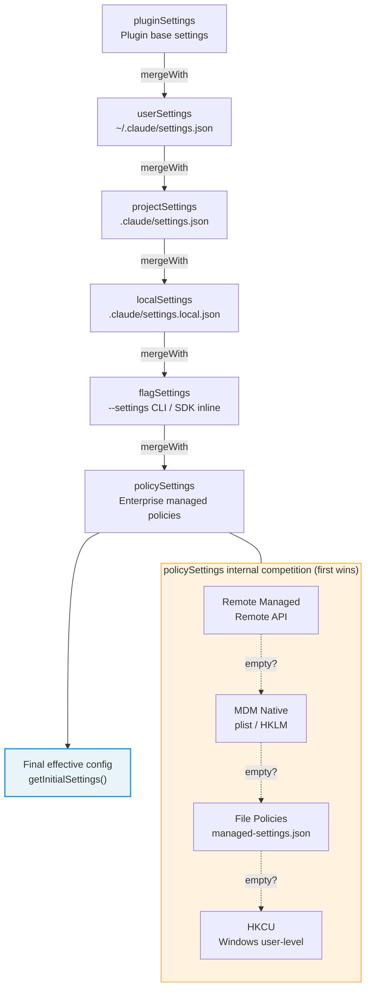

# Appendix B: Environment Variable Reference

This appendix lists the key user-configurable environment variables in Claude Code v2.1.88. Grouped by functional domain, only variables affecting user-visible behavior are listed; internal telemetry and platform detection variables are omitted.

## Context Compaction

| Variable | Effect | Default |
|----------|--------|---------|
| `CLAUDE_CODE_AUTO_COMPACT_WINDOW` | Override context window size (tokens) | Model default |
| `CLAUDE_AUTOCOMPACT_PCT_OVERRIDE` | Override auto-compaction threshold as percentage (0-100) | Computed value |
| `DISABLE_AUTO_COMPACT` | Completely disable auto-compaction | `false` |

## Effort and Reasoning

| Variable | Effect | Valid Values |
|----------|--------|-------------|
| `CLAUDE_CODE_EFFORT_LEVEL` | Override effort level | `low`, `medium`, `high`, `max`, `auto`, `unset` |
| `CLAUDE_CODE_DISABLE_FAST_MODE` | Disable Fast Mode accelerated output | `true`/`false` |
| `DISABLE_INTERLEAVED_THINKING` | Disable extended thinking | `true`/`false` |
| `MAX_THINKING_TOKENS` | Override thinking token limit | Model default |

## Tools and Output Limits

| Variable | Effect | Default |
|----------|--------|---------|
| `BASH_MAX_OUTPUT_LENGTH` | Max output characters for Bash commands | 8,000 |
| `CLAUDE_CODE_GLOB_TIMEOUT_SECONDS` | Glob search timeout (seconds) | Default |

## Permissions and Security

| Variable | Effect | Note |
|----------|--------|------|
| `CLAUDE_CODE_DUMP_AUTO_MODE` | Export YOLO classifier requests/responses | Debug only |
| `CLAUDE_CODE_DISABLE_COMMAND_INJECTION_CHECK` | Disable Bash command injection detection | Reduces security |

## API and Authentication

| Variable | Effect | Security Level |
|----------|--------|---------------|
| `ANTHROPIC_API_KEY` | Anthropic API authentication key | Credential |
| `ANTHROPIC_BASE_URL` | Custom API endpoint (proxy support) | Redirectable |
| `ANTHROPIC_MODEL` | Override default model | Safe |
| `CLAUDE_CODE_USE_BEDROCK` | Route inference through AWS Bedrock | Safe |
| `CLAUDE_CODE_USE_VERTEX` | Route inference through Google Vertex AI | Safe |
| `CLAUDE_CODE_EXTRA_BODY` | Append extra fields to API requests | Advanced use |
| `ANTHROPIC_CUSTOM_HEADERS` | Custom HTTP request headers | Safe |

## Model Selection

| Variable | Effect | Example |
|----------|--------|---------|
| `ANTHROPIC_DEFAULT_HAIKU_MODEL` | Custom Haiku model ID | Model string |
| `ANTHROPIC_DEFAULT_SONNET_MODEL` | Custom Sonnet model ID | Model string |
| `ANTHROPIC_DEFAULT_OPUS_MODEL` | Custom Opus model ID | Model string |
| `ANTHROPIC_SMALL_FAST_MODEL` | Fast inference model (e.g., for summaries) | Model string |
| `CLAUDE_CODE_SUBAGENT_MODEL` | Model used by sub-Agents | Model string |

## Prompt Caching

| Variable | Effect | Default |
|----------|--------|---------|
| `CLAUDE_CODE_ENABLE_PROMPT_CACHING` | Enable prompt caching | `true` |
| `DISABLE_PROMPT_CACHING` | Completely disable prompt caching | `false` |

## Session and Debugging

| Variable | Effect | Purpose |
|----------|--------|---------|
| `CLAUDE_CODE_DEBUG_LOG_LEVEL` | Log verbosity | `silent`/`error`/`warn`/`info`/`verbose` |
| `CLAUDE_CODE_PROFILE_STARTUP` | Enable startup performance profiling | Debug |
| `CLAUDE_CODE_PROFILE_QUERY` | Enable query pipeline profiling | Debug |
| `CLAUDE_CODE_JSONL_TRANSCRIPT` | Write session transcript as JSONL | File path |
| `CLAUDE_CODE_TMPDIR` | Override temporary directory | Path |

## Output and Formatting

| Variable | Effect | Default |
|----------|--------|---------|
| `CLAUDE_CODE_SIMPLE` | Minimal system prompt mode | `false` |
| `CLAUDE_CODE_DISABLE_TERMINAL_TITLE` | Disable setting terminal title | `false` |
| `CLAUDE_CODE_NO_FLICKER` | Reduce fullscreen mode flickering | `false` |

## MCP (Model Context Protocol)

| Variable | Effect | Default |
|----------|--------|---------|
| `MCP_TIMEOUT` | MCP server connection timeout (ms) | 10,000 |
| `MCP_TOOL_TIMEOUT` | MCP tool call timeout (ms) | 30,000 |
| `MAX_MCP_OUTPUT_TOKENS` | MCP tool output token limit | Default |

## Network and Proxy

| Variable | Effect | Note |
|----------|--------|------|
| `HTTP_PROXY` / `HTTPS_PROXY` | HTTP/HTTPS proxy | Redirectable |
| `NO_PROXY` | Host list to bypass proxy | Safe |
| `NODE_EXTRA_CA_CERTS` | Additional CA certificates | Affects TLS trust |

## Paths and Configuration

| Variable | Effect | Default |
|----------|--------|---------|
| `CLAUDE_CONFIG_DIR` | Override Claude configuration directory | `~/.claude` |

---

## Version Evolution: v2.1.91 New Variables

| Variable | Effect | Notes |
|----------|--------|-------|
| `CLAUDE_CODE_AGENT_COST_STEER` | Sub-agent cost steering | Controls resource consumption in multi-agent scenarios |
| `CLAUDE_CODE_RESUME_THRESHOLD_MINUTES` | Session resume time threshold | Controls the time window for session resumption |
| `CLAUDE_CODE_RESUME_TOKEN_THRESHOLD` | Session resume token threshold | Controls the token budget for session resumption |
| `CLAUDE_CODE_USE_ANTHROPIC_AWS` | AWS authentication path | Enables Anthropic AWS infrastructure authentication |
| `CLAUDE_CODE_SKIP_ANTHROPIC_AWS_AUTH` | Skip AWS authentication | Fallback path when AWS is unavailable |
| `CLAUDE_CODE_DISABLE_CLAUDE_API_SKILL` | Disable Claude API skill | Enterprise compliance scenario control |
| `CLAUDE_CODE_PLUGIN_KEEP_MARKETPLACE_ON_FAILURE` | Plugin marketplace fault tolerance | Retain cached version when marketplace fetch fails |
| `CLAUDE_CODE_REMOTE_SETTINGS_PATH` | Remote settings path override | Custom settings URL for enterprise deployment |

### v2.1.91 Removed Variables

| Variable | Original Effect | Removal Reason |
|----------|----------------|----------------|
| `CLAUDE_CODE_DISABLE_COMMAND_INJECTION_CHECK` | Disable command injection check | Tree-sitter infrastructure entirely removed |
| `CLAUDE_CODE_DISABLE_MOUSE_CLICKS` | Disable mouse clicks | Feature deprecated |
| `CLAUDE_CODE_MCP_INSTR_DELTA` | MCP instruction delta | Feature refactored |

---

## Configuration Priority System

Environment variables are just one facet of Claude Code's configuration system. The complete configuration system is composed of 6 layers of sources, merged from lowest to highest priority — later sources override earlier ones. Understanding this priority chain is crucial for diagnosing "why isn't my setting taking effect."

### Six-Layer Priority Model

Configuration sources are defined in `restored-src/src/utils/settings/constants.ts:7-22`, and the merge logic is implemented in the `loadSettingsFromDisk()` function at `restored-src/src/utils/settings/settings.ts:644-796`:

| Priority | Source ID | File Path / Source | Description |
|----------|-----------|-------------------|-------------|
| 0 (lowest) | pluginSettings | Plugin-provided base settings | Only includes whitelisted fields (e.g., `agent`), serves as the base layer for all file sources |
| 1 | `userSettings` | `~/.claude/settings.json` | User global settings, applies across all projects |
| 2 | `projectSettings` | `$PROJECT/.claude/settings.json` | Project shared settings, committed to version control |
| 3 | `localSettings` | `$PROJECT/.claude/settings.local.json` | Project local settings, automatically added to `.gitignore` |
| 4 | `flagSettings` | `--settings` CLI parameter + SDK inline settings | Temporary overrides passed via command line or SDK |
| 5 (highest) | `policySettings` | Enterprise managed policies (multiple competing sources) | Enterprise admin enforced policies, see below |

### Merge Semantics

Merging uses lodash's `mergeWith` for deep merge, with a custom merger defined at `restored-src/src/utils/settings/settings.ts:538-547`:

- **Objects**: Recursively merged, later source fields override earlier ones
- **Arrays**: Merged and deduplicated (`mergeArrays`), not replaced — this means `permissions.allow` rules from multiple layers accumulate
- **`undefined` values**: Interpreted as "delete this key" in `updateSettingsForSource` (`restored-src/src/utils/settings/settings.ts:482-486`)

This array merge semantic is particularly important: if a user allows a tool in `userSettings` and allows another tool in `projectSettings`, the final `permissions.allow` list includes both. This enables multi-layer permission configurations to stack rather than override each other.

### Policy Settings (policySettings) Four-Layer Competition

Policy settings (`policySettings`) have their own internal priority chain, using a "first source with content wins" strategy, implemented at `restored-src/src/utils/settings/settings.ts:322-345`:

| Sub-priority | Source | Description |
|-------------|--------|-------------|
| 1 (highest) | Remote Managed Settings | Enterprise policy cache synced from API |
| 2 | MDM Native Policies (HKLM / macOS plist) | System-level policies read via `plutil` or `reg query` |
| 3 | File Policies (`managed-settings.json` + `managed-settings.d/*.json`) | Drop-in directory support, merged in alphabetical order |
| 4 (lowest) | HKCU User Policies (Windows only) | User-level registry settings |

Note that policy settings merge differently from other sources: the four sub-sources within policies are in a **competitive relationship** (first one wins), while policies as a whole are in an **additive relationship** with other sources (deep merged to the top of the configuration chain).

### Override Chain Flowchart

**Figure B-1: Configuration Priority Override Chain**

### Caching and Invalidation

Configuration loading has a two-layer caching mechanism (`restored-src/src/utils/settings/settingsCache.ts`):

1. **File-level cache**: `parseSettingsFile()` caches the parsed result of each file, avoiding repeated JSON parsing
2. **Session-level cache**: `getSettingsWithErrors()` caches the merged final result, reused throughout the session

Caches are uniformly invalidated via `resetSettingsCache()` — triggered when the user modifies settings through the `/config` command or `updateSettingsForSource()`. Settings file change detection is handled by `restored-src/src/utils/settings/changeDetector.ts`, which drives React component re-rendering through file system watching.

### Diagnostic Recommendations

When a setting "isn't taking effect," troubleshoot in this order:

1. **Confirm the source**: Use the `/config` command to view the current effective configuration and source annotations
2. **Check priority**: Is a higher-priority source overriding your setting? `policySettings` is the strongest override
3. **Check array merging**: Permission rules are additive — if a `deny` rule appears in a higher-priority source, a lower-priority `allow` cannot override it
4. **Check caching**: After modifying `.json` files within the same session, the configuration may still be cached — restart the session or use `/config` to trigger a refresh
