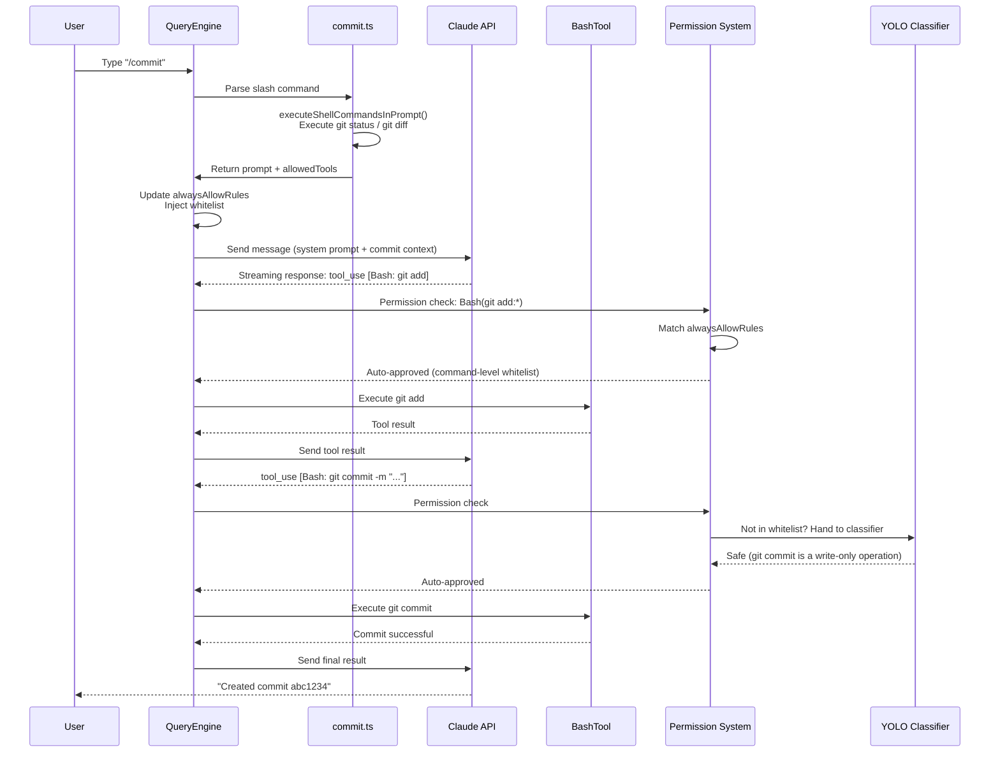
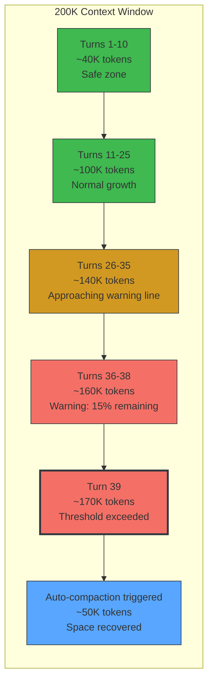
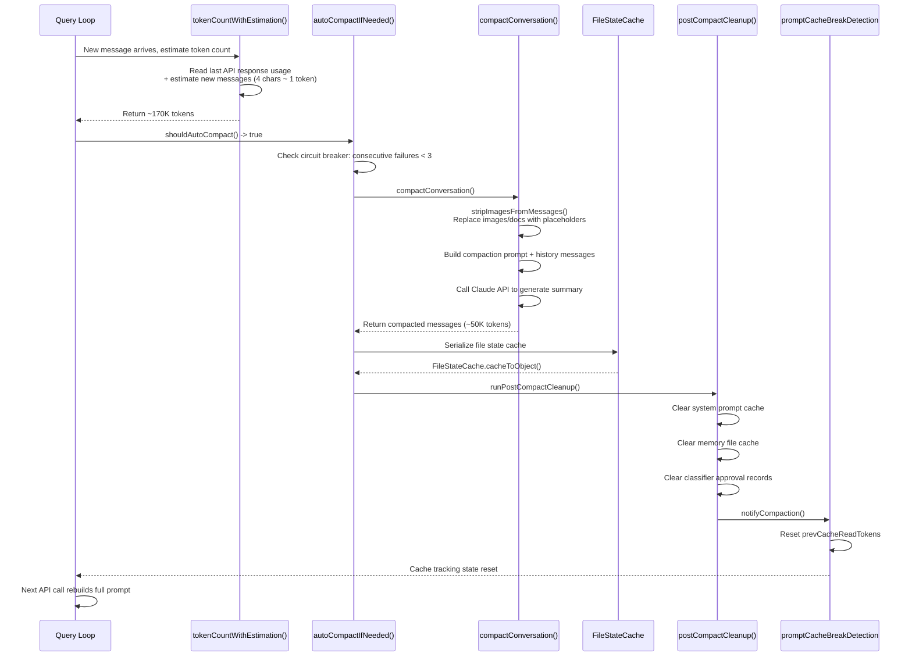
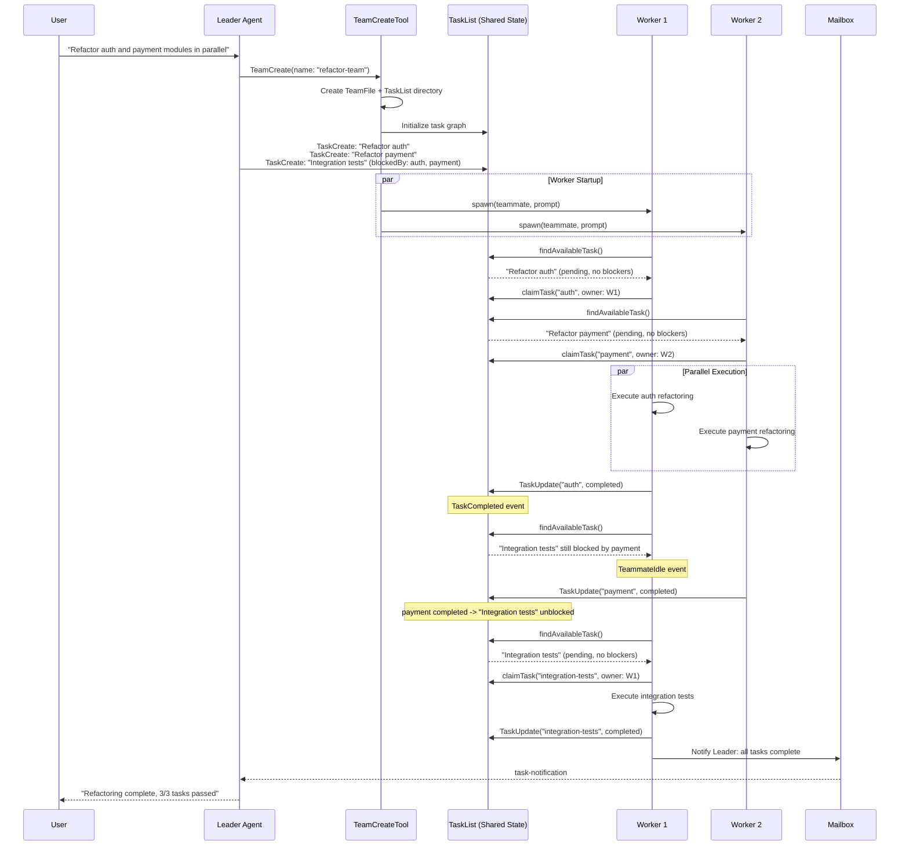

# Appendix F: End-to-End Case Traces

> This appendix connects the analyses across all chapters through three complete request lifecycle traces. Each case starts from user input, passes through multiple subsystems, and ends with the final output. When reading these cases, we recommend cross-referencing the cited chapters for a deeper understanding of each stage's internal mechanisms.

---

## Case 1: The Complete Journey of a `/commit`

> Linked chapters: Chapter 3 (Agent Loop) -> Chapter 5 (System Prompts) -> Chapter 4 (Tool Orchestration) -> Chapter 16 (Permission System) -> Chapter 17 (YOLO Classifier) -> Chapter 13 (Cache Hits)

### Scenario

The user types `/commit` in a git repository. Claude Code needs to: check workspace status, generate a commit message, execute git commit — automatically approving whitelisted git commands throughout.

### Request Flow



### Subsystem Interaction Details

**Phase 1: Command Parsing (Chapter 3)**

After the user inputs `/commit`, `QueryEngine.processUserInput()` recognizes the slash command prefix and looks up the `commit` command definition from the command registry (`restored-src/src/commands/commit.ts:6-82`). The command definition contains two key fields:

- `allowedTools`: `['Bash(git add:*)', 'Bash(git status:*)', 'Bash(git commit:*)']` — restricts the model to only these three types of git commands
- `getPromptContent()`: Before sending to the API, locally executes `git status` and `git diff HEAD` via `executeShellCommandsInPrompt()`, embedding the actual repository state into the prompt

This means the model receives not a vague "please help me commit" instruction, but a complete context including the current diff.

**Phase 2: Permission Injection (Chapter 16)**

Before calling the API, `QueryEngine` writes `allowedTools` into `AppState.toolPermissionContext.alwaysAllowRules.command` (`restored-src/src/QueryEngine.ts:477-486`). The effect: during this conversation turn, all tool calls matching the `Bash(git add:*)` pattern are automatically approved without user confirmation.

**Phase 3: API Call and Caching (Chapter 5, Chapter 13)**

The system prompt is split into multiple blocks with `cache_control` markers during the API call (`restored-src/src/utils/api.ts:72-84`). If the user has previously executed other commands, the prefix portion of the system prompt (tool definitions, basic rules) may hit the prompt cache, and only the new context injected by `/commit` needs to be reprocessed.

**Phase 4: Tool Execution and Classification (Chapter 4, Chapter 17)**

After the model returns `tool_use` blocks, the permission system checks in priority order:

1. First check `alwaysAllowRules` — `git add` and `git status` directly match the whitelist
2. For `git commit`, if not in the whitelist, hand to the YOLO classifier (`restored-src/src/utils/permissions/yoloClassifier.ts:54-68`) for safety assessment
3. `BashTool` executes the actual command, performing AST-level command parsing through `bashPermissions.ts`

**Phase 5: Attribution Calculation**

After the commit completes, `commitAttribution.ts` (`restored-src/src/utils/commitAttribution.ts:548-743`) calculates Claude's character contribution ratio to determine whether to add a `Co-Authored-By` signature to the commit message.

### What This Case Demonstrates

Behind a simple `/commit`, at least 6 subsystems collaborate: the command system provides context injection, the permission system provides whitelist auto-approval, the YOLO classifier provides fallback assessment, BashTool executes actual commands, prompt caching reduces redundant computation, and the attribution module handles authorship. This is the core of harness engineering — each subsystem fulfills its role, coordinated through the Agent Loop's unified cycle.

---

## Case 2: A Long Conversation Triggering Auto-Compaction

> Linked chapters: Chapter 9 (Auto-Compaction) -> Chapter 10 (File State Preservation) -> Chapter 11 (Micro-Compaction) -> Chapter 12 (Token Budget) -> Chapter 13 (Cache Architecture) -> Chapter 26 (Context Management Principles)

### Scenario

The user is having a lengthy refactoring conversation in a large codebase. After approximately 40 turns of interaction, the context window approaches the 200K token limit, triggering auto-compaction.

### Token Consumption Timeline



### Key Thresholds

| Threshold | Calculation | Approx. Value | Purpose |
|-----------|------------|---------------|---------|
| Context window | `MODEL_CONTEXT_WINDOW_DEFAULT` | 200,000 | Model maximum input |
| Effective window | Context window - max_output_tokens | ~180,000 | Reserve output space |
| Compaction threshold | Effective window - 13K buffer | ~167,000 | Trigger auto-compaction |
| Warning threshold | Effective window - 20K | ~160,000 | Log warning |
| Blocking threshold | Effective window - 3K | ~177,000 | Force execute /compact |

Source: `restored-src/src/services/compact/autoCompact.ts:28-91`, `restored-src/src/utils/context.ts:8-9`

### Compaction Execution Flow



### Subsystem Interaction Details

**Phase 1: Token Counting (Chapter 12)**

After each API call, `tokenCountWithEstimation()` (`restored-src/src/utils/tokens.ts:226-261`) reads `input_tokens + cache_creation_input_tokens + cache_read_input_tokens` from the last response, then adds estimated values for subsequently added messages (4 characters approximately equals 1 token). This function is the data foundation for all context management decisions.

**Phase 2: Threshold Evaluation (Chapter 9)**

`shouldAutoCompact()` (`restored-src/src/services/compact/autoCompact.ts:225-226`) compares the token count against the compaction threshold (~167K). After exceeding the threshold, it also checks the circuit breaker — if compaction has failed 3 consecutive times, it stops retrying (lines 260-265). This is a concrete implementation of Chapter 26's "circuit-break runaway loops" principle.

**Phase 3: Compaction Execution (Chapter 9)**

`compactConversation()` (`restored-src/src/services/compact/compact.ts:122-200`) performs the actual compaction:

1. Strip image and document content, replacing with `[image]`/`[document]` placeholders
2. Build the compaction prompt and send the complete message history to Claude for summary generation
3. Return the compacted message array (from approximately 400 messages reduced to approximately 80)

**Phase 4: File State Preservation (Chapter 10)**

Before compaction, `FileStateCache` (`restored-src/src/utils/fileStateCache.ts:30-143`) serializes all cached file paths, contents, and timestamps. This data is injected as an attachment into the post-compaction messages, ensuring the model still "remembers" which files were read and edited after compaction. The cache uses an LRU strategy with a limit of 100 entries and 25MB total size.

**Phase 5: Cache Invalidation (Chapter 13)**

After compaction completes, `runPostCompactCleanup()` (`restored-src/src/services/compact/postCompactCleanup.ts:31-77`) performs comprehensive cleanup:

- Clears the system prompt cache (`getUserContext.cache.clear()`)
- Clears the memory file cache
- Clears the YOLO classifier's approval records
- Notifies the cache tracking module to reset state (`notifyCompaction()`)

This means the first API call after compaction must rebuild the complete system prompt — the prompt cache will completely miss. This is the hidden cost of compaction: you save context space, but pay the price of a full cache rebuild.

### What This Case Demonstrates

Auto-compaction is not an isolated feature, but a collaboration of five subsystems: token counting, threshold evaluation, summary generation, file state preservation, and cache invalidation. It embodies Chapter 26's core principle: **context management is a core capability of the Agent, not an add-on feature**. Every step makes a precise trade-off between "preserving enough information" and "freeing enough space."

---

## Case 3: Multi-Agent Collaborative Execution

> Linked chapters: Chapter 20 (Agent Spawning) -> Chapter 20b (Teams Scheduling Kernel) -> Chapter 5 (System Prompt Variants) -> Chapter 25 (Harness Engineering Principles)

### Scenario

The user asks Claude Code to refactor multiple modules in parallel. The main Agent creates a Team, assigns tasks to sub-Agents, and sub-Agents automatically claim and complete tasks through the TaskList.

### Agent Communication Sequence



### Subsystem Interaction Details

**Phase 1: Team Creation (Chapter 20, Chapter 20b)**

`TeamCreateTool` (`restored-src/src/tools/AgentTool/AgentTool.tsx`) does two things: creates a `TeamFile` configuration and initializes the corresponding TaskList directory. As analyzed in Chapter 20b: **Team = TaskList** — the team and task table are two views of the same runtime object.

The Worker's physical backend is determined by `detectAndGetBackend()` (`restored-src/src/utils/swarm/backends/`):

| Backend | Process Model | Detection Condition |
|---------|--------------|-------------------|
| Tmux | Independent CLI process | Default backend (Linux/macOS) |
| iTerm2 | Independent CLI process | macOS + iTerm2 |
| In-Process | AsyncLocalStorage isolation | No tmux/iTerm2 |

**Phase 2: Task Graph Construction (Chapter 20b)**

The tasks created by the Leader are not a simple Todo list, but a DAG with `blocks`/`blockedBy` dependency relationships (`restored-src/src/utils/tasks.ts`):

```typescript
// restored-src/src/utils/tasks.ts
{
  id: "auth",
  status: "pending",
  blocks: ["integration-test"],
  blockedBy: [],
}
{
  id: "integration-test",
  status: "pending",
  blocks: [],
  blockedBy: ["auth", "payment"],
}
```

This design allows the Leader to declare all tasks and their dependencies at once, leaving "when things can run in parallel" to the runtime to determine.

**Phase 3: Auto-Claim (Chapter 20b)**

`findAvailableTask()` in `useTaskListWatcher.ts` is the Swarm's minimal scheduler:

1. Filter tasks with `status === 'pending'` and empty `owner`
2. Check whether all tasks in `blockedBy` have been completed
3. Once found, `claimTask()` atomically claims ownership

This implements one of Chapter 25's core principles: **separate scheduling from reasoning** — the model doesn't need to judge task dependencies in natural language; the runtime has already narrowed the candidates to a single clear task.

**Phase 4: Context Isolation (Chapter 20)**

Each In-Process Worker maintains independent context via `AsyncLocalStorage` (`restored-src/src/utils/teammateContext.ts:41-64`):

```typescript
// restored-src/src/utils/teammateContext.ts:41
const teammateStorage = new AsyncLocalStorage<TeammateContext>();
```

`TeammateContext` includes fields such as `agentId`, `agentName`, `teamName`, and `parentSessionId`. This ensures that multiple Agents within the same process don't contaminate each other's state.

**Phase 5: Event Surface (Chapter 20b)**

After a Worker completes a task, two types of events are triggered (`restored-src/src/query/stopHooks.ts`):

- `TaskCompleted`: Marks the task as complete, potentially unblocking other tasks
- `TeammateIdle`: Worker enters idle state, returns to TaskList to find new tasks

This makes Teams a hybrid pull + push model — idle Workers actively pull tasks, while task completion events push to the Leader.

**Phase 6: Communication (Chapter 20b)**

Workers don't talk directly to each other. All collaboration flows through two channels:

- **TaskList** (shared file system state): `~/.claude/tasks/{team-name}/`
- **Mailbox** (persistent message queue): `~/.claude/teams/{team}/inboxes/*.json`

When `task-notification` messages are injected into the Leader's message stream, the prompt explicitly requires them to be distinguished via `<task-notification>` tags (not user input).

### What This Case Demonstrates

The core of multi-Agent collaboration is not "letting Agents chat with each other," but rather the **shared task graph + atomic claim + turn-end events** forming the collaboration kernel. Claude Code's Swarm is essentially a distributed scheduler: the Leader declares task dependencies, Workers automatically claim tasks, and the runtime manages concurrency conflicts. This is a direct embodiment of Chapter 25's principle: "first externalize the collaboration state, then let different execution units collaborate around it."
