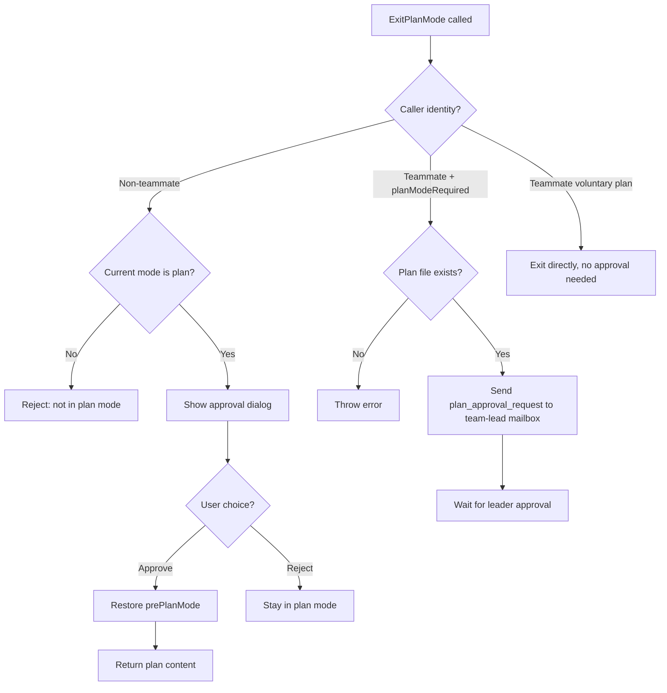
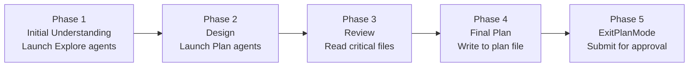

# Chapter 4b: Plan Mode — From "Act First, Ask Later" to "Look Before You Leap"

> **Positioning**: This chapter analyzes Claude Code's Plan Mode — a complete "plan first, execute second" state machine. Prerequisites: Chapter 3 (Agent Loop), Chapter 4 (Tool Execution Orchestration). Use when: you want to understand how CC implements a human-aligned planning approval mechanism, or want to implement a similar "plan before act" workflow in your own AI Agent.

---

## Why This Matters

One of the biggest risks with AI coding agents isn't writing incorrect code — it's **writing correct code for the wrong thing**. When a user says "refactor the auth module," the agent might choose JWT while the user had OAuth2 in mind. If the agent starts implementing immediately, by the time the user discovers the direction is wrong, dozens of files have already been modified.

Plan Mode solves the **intent alignment** problem: before the agent modifies any code, it first explores the codebase, creates a plan, and obtains user approval. This isn't a simple "ask before doing" — it's a complete state machine involving permission mode switching, plan file persistence, workflow prompt injection, inter-team approval protocols, and complex interactions with Auto Mode.

From an engineering perspective, Plan Mode demonstrates three key design decisions:

1. **Permission modes as behavioral constraints**: After entering plan mode, the model's toolset is restricted to read-only — not through a prompt saying "please don't modify files," but through the permission system intercepting write operations before tool execution.
2. **Plan files as alignment vehicles**: Plans don't stay in conversation context as text — they're written to disk as Markdown files that users can edit in external editors and that CCR remote sessions can transmit back to the local terminal.
3. **A state machine, not a boolean flag**: Plan Mode isn't a simple `isPlanMode` flag — it's a complete state transition chain encompassing entry, exploration, approval, exit, and restoration, where each transition has side effects to manage.

---

## 4b.1 The Plan Mode State Machine: Entry and Exit

At the core of Plan Mode are two tools — `EnterPlanMode` and `ExitPlanMode` — and the permission mode transitions they trigger.

### Entering Plan Mode

There are two paths to enter Plan Mode:

1. **The model proactively calls the `EnterPlanMode` tool** — requires user confirmation
2. **The user manually types the `/plan` command** — takes effect immediately

Both paths ultimately call the same core function, `prepareContextForPlanMode`:

```typescript
// restored-src/src/utils/permissions/permissionSetup.ts:1462-1492
export function prepareContextForPlanMode(
  context: ToolPermissionContext,
): ToolPermissionContext {
  const currentMode = context.mode
  if (currentMode === 'plan') return context
  if (feature('TRANSCRIPT_CLASSIFIER')) {
    const planAutoMode = shouldPlanUseAutoMode()
    if (currentMode === 'auto') {
      if (planAutoMode) {
        return { ...context, prePlanMode: 'auto' }
      }
      // ... deactivate auto mode and restore permissions stripped by auto
    }
    if (planAutoMode && currentMode !== 'bypassPermissions') {
      autoModeStateModule?.setAutoModeActive(true)
      return {
        ...stripDangerousPermissionsForAutoMode(context),
        prePlanMode: currentMode,
      }
    }
  }
  return { ...context, prePlanMode: currentMode }
}
```

Key design: **The `prePlanMode` field saves the mode before entry**. This is a classic "save/restore" pattern — when entering plan mode, the current mode (which could be `default`, `auto`, or `acceptEdits`) is stored in `prePlanMode`, and restored on exit. This ensures Plan Mode is a **reversible operation** that doesn't lose the user's previous permission configuration.

The `EnterPlanMode` tool definition itself reveals several important constraints:

```typescript
// restored-src/src/tools/EnterPlanModeTool/EnterPlanModeTool.ts:36-102
export const EnterPlanModeTool: Tool<InputSchema, Output> = buildTool({
  name: ENTER_PLAN_MODE_TOOL_NAME,
  shouldDefer: true,
  isEnabled() {
    // Disabled when --channels is active, preventing plan mode from becoming a trap
    if ((feature('KAIROS') || feature('KAIROS_CHANNELS')) &&
        getAllowedChannels().length > 0) {
      return false
    }
    return true
  },
  isConcurrencySafe() { return true },
  isReadOnly() { return true },
  async call(_input, context) {
    if (context.agentId) {
      throw new Error('EnterPlanMode tool cannot be used in agent contexts')
    }
    // ... execute mode switch
  },
})
```

Three constraints worth noting:

| Constraint | Code | Reason |
|-----------|------|--------|
| `shouldDefer: true` | Tool definition | Deferred loading — doesn't consume initial schema space (see Chapter 2) |
| Forbidden in agent contexts | `context.agentId` check | Sub-agents should not enter plan mode on their own — this is a main session privilege |
| Disabled when channels active | `getAllowedChannels()` check | In KAIROS mode, users may be on Telegram/Discord and unable to see the approval dialog — entering plan mode with no way to exit creates a "trap" |

### Exiting Plan Mode

Exiting is far more complex than entering. `ExitPlanModeV2Tool` has three execution paths:



The most complex part of exiting is **permission restoration**:

```typescript
// restored-src/src/tools/ExitPlanModeTool/ExitPlanModeV2Tool.ts:357-403
context.setAppState(prev => {
  if (prev.toolPermissionContext.mode !== 'plan') return prev
  setHasExitedPlanMode(true)
  setNeedsPlanModeExitAttachment(true)
  let restoreMode = prev.toolPermissionContext.prePlanMode ?? 'default'
  
  if (feature('TRANSCRIPT_CLASSIFIER')) {
    // Circuit breaker defense: if auto mode gate is disabled, fall back to default
    if (restoreMode === 'auto' &&
        !(permissionSetupModule?.isAutoModeGateEnabled() ?? false)) {
      restoreMode = 'default'
    }
    // ... sync auto mode activation state
  }
  
  // Non-auto mode: restore dangerous permissions that were stripped
  const restoringToAuto = restoreMode === 'auto'
  if (restoringToAuto) {
    baseContext = permissionSetupModule?.stripDangerousPermissionsForAutoMode(baseContext)
  } else if (prev.toolPermissionContext.strippedDangerousRules) {
    baseContext = permissionSetupModule?.restoreDangerousPermissions(baseContext)
  }
  
  return {
    ...prev,
    toolPermissionContext: {
      ...baseContext,
      mode: restoreMode,
      prePlanMode: undefined, // clear the saved mode
    },
  }
})
```

This code demonstrates a **circuit breaker defense pattern**: if the user entered plan from auto mode, but during the plan the auto mode circuit breaker tripped (e.g., consecutive rejections exceeded the limit), exiting plan won't restore to auto — it falls back to `default` instead. This prevents a dangerous scenario: Plan Mode exit bypassing the circuit breaker to restore auto mode directly.

### State Transition Debouncing

Users might rapidly toggle plan mode (enter → immediately exit → enter again). `handlePlanModeTransition` handles this edge case:

```typescript
// restored-src/src/bootstrap/state.ts:1349-1363
export function handlePlanModeTransition(fromMode: string, toMode: string): void {
  // When switching TO plan, clear any pending exit attachment — prevents sending both enter and exit notifications
  if (toMode === 'plan' && fromMode !== 'plan') {
    STATE.needsPlanModeExitAttachment = false
  }
  // When leaving plan, mark that an exit attachment needs to be sent
  if (fromMode === 'plan' && toMode !== 'plan') {
    STATE.needsPlanModeExitAttachment = true
  }
}
```

This is a classic **one-shot notification** design — the attachment flag is cleared immediately after consumption, preventing duplicate sends.

---

## 4b.2 Plan Files: Persistent Intent Alignment

A key design decision in Plan Mode is: **plans don't stay in conversation context — they're written to disk files**. This brings three benefits:

1. Users can modify plans in an external editor (`/plan open`)
2. Plans survive context compaction without loss (see Chapter 10)
3. Plans from CCR remote sessions can be transmitted back to the local terminal

### File Naming and Storage

```typescript
// restored-src/src/utils/plans.ts:79-128
export const getPlansDirectory = memoize(function getPlansDirectory(): string {
  const settings = getInitialSettings()
  const settingsDir = settings.plansDirectory
  let plansPath: string

  if (settingsDir) {
    const cwd = getCwd()
    const resolved = resolve(cwd, settingsDir)
    // Path traversal defense
    if (!resolved.startsWith(cwd + sep) && resolved !== cwd) {
      logError(new Error(`plansDirectory must be within project root: ${settingsDir}`))
      plansPath = join(getClaudeConfigHomeDir(), 'plans')
    } else {
      plansPath = resolved
    }
  } else {
    plansPath = join(getClaudeConfigHomeDir(), 'plans')
  }
  // ...
})

export function getPlanFilePath(agentId?: AgentId): string {
  const planSlug = getPlanSlug(getSessionId())
  if (!agentId) {
    return join(getPlansDirectory(), `${planSlug}.md`)  // main session
  }
  return join(getPlansDirectory(), `${planSlug}-agent-${agentId}.md`)  // sub-agent
}
```

| Dimension | Design Decision | Reason |
|-----------|----------------|--------|
| Default location | `~/.claude/plans/` | Project-independent global directory — doesn't pollute the code repository |
| Configurable | `settings.plansDirectory` | Teams can configure it to a project-local directory like `.claude/plans/` |
| Path traversal defense | `resolved.startsWith(cwd + sep)` | Prevents configured paths from escaping the project root |
| Filename | `{wordSlug}.md` | Uses word slugs (e.g., `brave-fox.md`) instead of UUIDs — human-readable |
| Sub-agent isolation | `{wordSlug}-agent-{agentId}.md` | Each sub-agent gets an independent plan file to avoid overwrites |
| Memoization | `memoize(getPlansDirectory)` | Avoids triggering `mkdirSync` syscalls on every tool render (#20005 regression fix) |

### Plan Slug Generation

Each session generates a unique word slug, cached in `planSlugCache`:

```typescript
// restored-src/src/utils/plans.ts:32-49
export function getPlanSlug(sessionId?: SessionId): string {
  const id = sessionId ?? getSessionId()
  const cache = getPlanSlugCache()
  let slug = cache.get(id)
  if (!slug) {
    const plansDir = getPlansDirectory()
    for (let i = 0; i < MAX_SLUG_RETRIES; i++) {
      slug = generateWordSlug()
      const filePath = join(plansDir, `${slug}.md`)
      if (!getFsImplementation().existsSync(filePath)) {
        break  // found a non-conflicting slug
      }
    }
    cache.set(id, slug!)
  }
  return slug!
}
```

Conflict detection retries up to 10 times (`MAX_SLUG_RETRIES = 10`). Since `generateWordSlug()` uses `adjective-noun` combinations (vocabulary sizes typically in the thousands for each word type, yielding millions of possible combinations), collision probability is extremely low even in frequently-used directories.

### The `/plan` Command

Users interact with plans through the `/plan` command:

```typescript
// restored-src/src/commands/plan/plan.tsx:64-121
export async function call(onDone, context, args) {
  const currentMode = appState.toolPermissionContext.mode
  
  // If not in plan mode, enable it
  if (currentMode !== 'plan') {
    handlePlanModeTransition(currentMode, 'plan')
    setAppState(prev => ({
      ...prev,
      toolPermissionContext: applyPermissionUpdate(
        prepareContextForPlanMode(prev.toolPermissionContext),
        { type: 'setMode', mode: 'plan', destination: 'session' },
      ),
    }))
    const description = args.trim()
    if (description && description !== 'open') {
      onDone('Enabled plan mode', { shouldQuery: true })  // with description → trigger query
    } else {
      onDone('Enabled plan mode')
    }
    return null
  }
  
  // Already in plan mode — show current plan or open in editor
  if (argList[0] === 'open') {
    const result = await editFileInEditor(planPath)
    // ...
  }
}
```

The `/plan` command has four behaviors:
- `/plan` — Enable plan mode (if not already in plan mode)
- `/plan <description>` — Enable plan mode with a description (`shouldQuery: true` triggers the model to start planning)
- `/plan` (already in plan mode) — Display current plan content and file path; shows "No plan written yet" if no plan exists
- `/plan open` — Open the plan file in an external editor

---

## 4b.3 Plan Prompt Injection: The 5-Phase Workflow

After entering Plan Mode, the system injects workflow instructions into the model via **attachment messages**. This is the core behavioral constraint of Plan Mode — rather than using tool restrictions to tell the model "what it can't do," prompts tell the model "what it should do."

### Attachment Types

Plan Mode uses three attachment types:

| Attachment Type | Trigger | Content |
|----------------|---------|---------|
| `plan_mode` | Injected every N human message turns | Full or sparse workflow instructions |
| `plan_mode_reentry` | Re-entering plan mode after exiting | "You previously exited plan mode — check the existing plan first" |
| `plan_mode_exit` | First turn after exiting plan mode | "You've exited plan mode — you can now start implementing" |

### Full vs. Sparse Throttling

```typescript
// restored-src/src/utils/attachments.ts:1195-1241
function getPlanModeAttachments(messages, toolUseContext) {
  // Check how many human turns since the last plan_mode attachment
  const { turnCount, foundPlanModeAttachment } = 
    getPlanModeAttachmentTurnCount(messages)
  
  // Already have an attachment and interval too short → skip
  if (foundPlanModeAttachment &&
      turnCount < PLAN_MODE_ATTACHMENT_CONFIG.TURNS_BETWEEN_ATTACHMENTS) {
    return []
  }
  
  // Decide full or sparse
  const attachmentCount = countPlanModeAttachmentsSinceLastExit(messages)
  const reminderType = attachmentCount %
    PLAN_MODE_ATTACHMENT_CONFIG.FULL_REMINDER_EVERY_N_ATTACHMENTS === 1
    ? 'full' : 'sparse'
  
  attachments.push({ type: 'plan_mode', reminderType, isSubAgent, planFilePath, planExists })
  return attachments
}
```

**Full attachments** contain the complete 5-phase workflow instructions (~2,000+ characters). **Sparse attachments** are a single-line reminder:

```
Plan mode still active (see full instructions earlier in conversation). 
Read-only except plan file ({planFilePath}). Follow 5-phase workflow.
```

This is a **token cost optimization** — full instructions are only injected on the 1st, 6th, 11th... occurrence; all other turns use sparse. The counter resets each time plan mode is exited.

### The 5-Phase Workflow (Standard Mode)

When `isPlanModeInterviewPhaseEnabled()` returns `false`, the model receives 5-phase instructions:



```typescript
// restored-src/src/utils/messages.ts:3227-3292 (core instructions, simplified)
const content = `Plan mode is active. The user indicated that they do not want 
you to execute yet -- you MUST NOT make any edits (with the exception of the 
plan file mentioned below)...

## Plan Workflow

### Phase 1: Initial Understanding
Goal: Gain a comprehensive understanding of the user's request...
Launch up to ${exploreAgentCount} Explore agents IN PARALLEL...

### Phase 2: Design
Launch Plan agent(s) to design the implementation...
You can launch up to ${agentCount} agent(s) in parallel.

### Phase 3: Review
Read the critical files identified by agents...
Use AskUserQuestion to clarify any remaining questions.

### Phase 4: Final Plan
Write your final plan to the plan file (the only file you can edit).

### Phase 5: Call ExitPlanMode
Once you are happy with your final plan file - call ExitPlanMode.
This is critical - your turn should only end with either AskUserQuestion OR ExitPlanMode.`
```

Agent counts are dynamically adjusted based on subscription tier:

```typescript
// restored-src/src/utils/planModeV2.ts:5-29
export function getPlanModeV2AgentCount(): number {
  // Environment variable override
  if (process.env.CLAUDE_CODE_PLAN_V2_AGENT_COUNT) { /* ... */ }
  // Max 20x subscription → 3 agents
  if (subscriptionType === 'max' && rateLimitTier === 'default_claude_max_20x') return 3
  // Enterprise/Team → 3 agents
  if (subscriptionType === 'enterprise' || subscriptionType === 'team') return 3
  // Others → 1 agent
  return 1
}
```

| Subscription Tier | Plan Agents | Explore Agents |
|------------------|-------------|----------------|
| Max (20x) | 3 | 3 |
| Enterprise / Team | 3 | 3 |
| Others | 1 | 3 |

### Interview Workflow (Iterative Mode)

When `isPlanModeInterviewPhaseEnabled()` returns `true` (always true for Anthropic internal users), a different workflow is used:

```typescript
// restored-src/src/utils/messages.ts:3323-3378
const content = `Plan mode is active...

## Iterative Planning Workflow

You are pair-planning with the user. Explore the code to build context, 
ask the user questions when you hit decisions you can't make alone, and 
write your findings into the plan file as you go.

### The Loop
Repeat this cycle until the plan is complete:
1. **Explore** — Use Read, Glob, Grep to read code...
2. **Update the plan file** — After each discovery, immediately capture what you learned.
3. **Ask the user** — When you hit an ambiguity, use AskUserQuestion. Then go back to step 1.

### First Turn
Start by quickly scanning a few key files... Then write a skeleton plan and 
ask the user your first round of questions. Don't explore exhaustively before engaging the user.

### Asking Good Questions
- Never ask what you could find out by reading the code
- Batch related questions together
- Focus on things only the user can answer: requirements, preferences, tradeoffs`
```

Core differences between interview mode and the standard 5-phase mode:

| Dimension | 5-Phase Mode | Interview Mode |
|-----------|-------------|----------------|
| Interaction style | Explore fully, then submit plan | Explore and ask iteratively |
| Agent usage | Forced use of Explore/Plan agents | Direct tool use encouraged, agents optional |
| Plan file | Written once in Phase 4 | Incrementally updated with each discovery |
| User involvement | Final approval in Phase 5 | Continuous participation, multi-turn conversation |
| Target users | External users (more automated) | Internal users (more collaborative) |

### Pewter Ledger Experiment: Plan File Length Optimization

An interesting A/B experiment in Plan Mode is `tengu_pewter_ledger` — optimizing plan file structure and length:

```typescript
// restored-src/src/utils/planModeV2.ts:66-95
// Baseline (control, 14d ending 2026-03-02, N=26.3M):
//   p50 4,906 chars | p90 11,617 | mean 6,207 | 82% Opus 4.6
//   Reject rate monotonic with size: 20% at <2K → 50% at 20K+
//
// Primary: session-level Avg Cost
export function getPewterLedgerVariant(): PewterLedgerVariant {
  const raw = getFeatureValue_CACHED_MAY_BE_STALE('tengu_pewter_ledger', null)
  if (raw === 'trim' || raw === 'cut' || raw === 'cap') return raw
  return null
}
```

Four experiment arms progressively tighten Phase 4 instructions:

| Arm | Key Instruction | Target Effect |
|-----|----------------|---------------|
| **control** | "Begin with Context section... concise enough to scan quickly" | Baseline: mean 6,207 chars |
| **trim** | "One-line Context... single verification command" | Light compression |
| **cut** | "Do NOT write Context/Background... Most good plans under 40 lines" | Moderate compression |
| **cap** | "Hard limit: 40 lines. If longer, delete prose — not file paths" | Hard cap |

The baseline data recorded in comments reveals a key finding: **rejection rate is monotonically correlated with plan length** — plans under 2K characters have a 20% rejection rate, while 20K+ plans have a 50% rejection rate. Longer plans don't mean better plans.

### Different Trigger Thresholds for Internal vs. External Users

The EnterPlanMode tool prompt has two versions:

```typescript
// restored-src/src/tools/EnterPlanModeTool/prompt.ts:166-170
export function getEnterPlanModeToolPrompt(): string {
  return process.env.USER_TYPE === 'ant'
    ? getEnterPlanModeToolPromptAnt()
    : getEnterPlanModeToolPromptExternal()
}
```

| Dimension | External Version | Internal Version |
|-----------|-----------------|-----------------|
| Trigger threshold | **Low** — "Prefer using EnterPlanMode for implementation tasks unless simple" | **High** — "Plan mode is valuable when approach is genuinely unclear" |
| Example difference | "Add a delete button" → **should** plan (involves confirmation dialog, API, state) | "Add a delete button" → **should not** plan ("Implementation path is clear") |
| Default preference | "If unsure, err on the side of planning" | "Prefer starting work and using AskUserQuestion" |

This internal/external difference reflects a product strategy: external users need more alignment protection (avoiding costly rework when the agent diverges), while internal users are more familiar with tool behavior and prefer fast execution.

---

## 4b.4 The Approval Flow: The Critical Human-AI Collaboration Point

### User Approval (Standard Flow)

When the model calls `ExitPlanMode`, the user approval dialog is triggered for non-teammate scenarios:

```typescript
// restored-src/src/tools/ExitPlanModeTool/ExitPlanModeV2Tool.ts:221-238
async checkPermissions(input, context) {
  if (isTeammate()) {
    return { behavior: 'allow' as const, updatedInput: input }
  }
  return {
    behavior: 'ask' as const,
    message: 'Exit plan mode?',
    updatedInput: input,
  }
}
```

After approval, `mapToolResultToToolResultBlockParam` injects the approved plan into the tool_result:

```typescript
// restored-src/src/tools/ExitPlanModeTool/ExitPlanModeV2Tool.ts:481-492
return {
  type: 'tool_result',
  content: `User has approved your plan. You can now start coding. Start with updating your todo list if applicable

Your plan has been saved to: ${filePath}
You can refer back to it if needed during implementation.${teamHint}

## ${planLabel}:
${plan}`,
  tool_use_id: toolUseID,
}
```

If the user edited the plan in the CCR Web UI, the `planWasEdited` flag ensures the model knows the content was modified:

```typescript
// restored-src/src/tools/ExitPlanModeTool/ExitPlanModeV2Tool.ts:477-478
const planLabel = planWasEdited
  ? 'Approved Plan (edited by user)'
  : 'Approved Plan'
```

### Team Leader Approval

In Teams mode, teammate agents' plans require team lead approval (see Chapter 20b). `ExitPlanModeV2Tool` sends approval requests through the mailbox system:

```typescript
// restored-src/src/tools/ExitPlanModeTool/ExitPlanModeV2Tool.ts:264-312
if (isTeammate() && isPlanModeRequired()) {
  const approvalRequest = {
    type: 'plan_approval_request',
    from: agentName,
    timestamp: new Date().toISOString(),
    planFilePath: filePath,
    planContent: plan,
    requestId,
  }
  
  await writeToMailbox('team-lead', {
    from: agentName,
    text: jsonStringify(approvalRequest),
    timestamp: new Date().toISOString(),
  }, teamName)
  
  return {
    data: {
      plan, isAgent: true, filePath,
      awaitingLeaderApproval: true,
      requestId,
    },
  }
}
```

The approval request is a JSON message written to the team lead's mailbox file (`~/.claude/teams/{team}/inboxes/team-lead.json`). Messages use `proper-lockfile` for concurrency safety.

### Plan Execution Verification

The ExitPlanMode return value includes a `hasTaskTool` flag:

```typescript
// restored-src/src/tools/ExitPlanModeTool/ExitPlanModeV2Tool.ts:405-408
const hasTaskTool =
  isAgentSwarmsEnabled() &&
  context.options.tools.some(t => toolMatchesName(t, AGENT_TOOL_NAME))
```

When Agent Swarms are available, a hint is appended to the tool_result:

> If this plan can be broken down into multiple independent tasks, consider using the TeamCreate tool to create a team and parallelize the work.

This **seamlessly connects** Plan Mode output to multi-agent execution (see Chapter 20b).

---

## 4b.5 Auto Mode and Plan Mode Interaction

Auto Mode (YOLO classifier, see Chapter 17) and Plan Mode interaction is one of the most complex parts of CC's permission system.

### Permission Saving on Entry

When a user enters plan mode from auto mode, there are two strategies:

```typescript
// restored-src/src/utils/permissions/permissionSetup.ts:1469-1486
if (currentMode === 'auto') {
  if (planAutoMode) {
    // Keep auto active → classifier continues working during plan
    return { ...context, prePlanMode: 'auto' }
  }
  // Deactivate auto → strip dangerous permissions
  // ...
}
```

`shouldPlanUseAutoMode()` determines based on user settings whether to keep the classifier active during plan mode. If kept active, the model's read-only operations in plan mode are still auto-approved by the classifier; if deactivated, all operations require user confirmation.

### Circuit Breaker Check on Exit

```typescript
// restored-src/src/tools/ExitPlanModeTool/ExitPlanModeV2Tool.ts:328-346
if (feature('TRANSCRIPT_CLASSIFIER')) {
  const prePlanRaw = appState.toolPermissionContext.prePlanMode ?? 'default'
  if (prePlanRaw === 'auto' &&
      !(permissionSetupModule?.isAutoModeGateEnabled() ?? false)) {
    const reason = permissionSetupModule?.getAutoModeUnavailableReason() ?? 'circuit-breaker'
    gateFallbackNotification = 
      permissionSetupModule?.getAutoModeUnavailableNotification(reason) ??
      'auto mode unavailable'
  }
}
```

This logic ensures: **if the auto mode circuit breaker tripped during plan mode (e.g., the classifier exceeded consecutive rejection limits), exiting plan won't restore to auto — it degrades to default instead**. The user sees a notification:

> plan exit → default · auto mode unavailable

### Mid-Session Settings Changes

If the user modifies the `useAutoModeDuringPlan` setting while in plan mode, `transitionPlanAutoMode` takes effect immediately:

```typescript
// restored-src/src/utils/permissions/permissionSetup.ts:1502-1517
export function transitionPlanAutoMode(
  context: ToolPermissionContext,
): ToolPermissionContext {
  if (context.mode !== 'plan') return context
  // Plan entered from bypassPermissions doesn't allow auto activation
  if (context.prePlanMode === 'bypassPermissions') return context
  
  const want = shouldPlanUseAutoMode()
  const have = autoModeStateModule?.isAutoModeActive() ?? false
  // Activate or deactivate auto based on want/have
}
```

---

## 4b.6 The Plan Agent: A Read-Only Architect

Plan Mode's 5-phase workflow uses the built-in Plan agent in Phase 2 (see Chapter 20 for the agent system). This agent's definition shows how read-only behavior is enforced through tool restrictions:

```typescript
// restored-src/src/tools/AgentTool/built-in/planAgent.ts:73-92
export const PLAN_AGENT: BuiltInAgentDefinition = {
  agentType: 'Plan',
  disallowedTools: [
    AGENT_TOOL_NAME,      // cannot spawn sub-agents
    EXIT_PLAN_MODE_TOOL_NAME,  // cannot exit plan mode
    FILE_EDIT_TOOL_NAME,  // cannot edit files
    FILE_WRITE_TOOL_NAME, // cannot write files
    NOTEBOOK_EDIT_TOOL_NAME,
  ],
  tools: EXPLORE_AGENT.tools,
  omitClaudeMd: true,     // don't inject CLAUDE.md, saves tokens
  getSystemPrompt: () => getPlanV2SystemPrompt(),
}
```

The Plan agent's system prompt further reinforces the read-only constraint:

```
=== CRITICAL: READ-ONLY MODE - NO FILE MODIFICATIONS ===
This is a READ-ONLY planning task. You are STRICTLY PROHIBITED from:
- Creating new files (no Write, touch, or file creation of any kind)
- Modifying existing files (no Edit operations)
- Using redirect operators (>, >>, |) or heredocs to write to files
- Running ANY commands that change system state
```

The dual constraint (tool blocklist + prompt prohibition) ensures that even if the model "forgets" the tool restrictions, the prompt will prevent it from attempting write operations.

---

## Pattern Extraction

From Plan Mode's implementation, the following reusable AI Agent design patterns can be extracted:

### Pattern 1: Save/Restore Permission Mode

**Problem**: After temporarily entering a restricted mode, you need to precisely restore the previous state.

**Solution**: Add a `prePlanMode` field to the permission context — save on entry, restore on exit.

```
Entry: context.prePlanMode = context.mode; context.mode = 'plan'
Exit:  context.mode = context.prePlanMode; context.prePlanMode = undefined
```

**Precondition**: On exit, you must check whether external conditions (like circuit breakers) still permit restoration to the original mode. If not, degrade to a safe default.

### Pattern 2: Plan File as Alignment Vehicle

**Problem**: Plans in conversation context get lost during compaction; users can't view or edit them outside the agent.

**Solution**: Write plans to disk files with human-readable naming (word slugs), supporting external editing and cross-session recovery.

**Precondition**: Requires path traversal defense, conflict detection, and snapshot persistence for remote sessions.

### Pattern 3: Full/Sparse Throttling

**Problem**: Injecting full workflow instructions every turn wastes tokens, but not reminding the model at all causes workflow drift.

**Solution**: Inject full instructions on first occurrence, use sparse reminders subsequently, re-inject full every N times. Reset counter on state transitions.

**Precondition**: Count by human turns (not tool call turns), otherwise 10 tool calls would trigger repeated reminders.

### Pattern 4: Internal/External Behavioral Calibration

**Problem**: Different user populations have different expectations for agent autonomy. External users need more alignment protection; internal users need more execution efficiency.

**Solution**: Differentiate prompt variants via `USER_TYPE`. External version lowers the trigger threshold ("if unsure, plan"); internal version raises it ("start working, ask specific questions").

**Precondition**: Requires A/B testing infrastructure to validate how different thresholds affect user satisfaction and rework rates.

### Pattern 5: State Transition Debouncing

**Problem**: Rapid mode toggles (plan → normal → plan) can cause duplicate or contradictory notifications.

**Solution**: Use single-consumption flags (`needsPlanModeExitAttachment`); on entry, clear any pending exit notifications; on exit, set new notifications.

**Precondition**: Flags must be cleared immediately after consumption (attachment sent), and entry/exit operations must operate on flags mutually exclusively.

---

## What Users Can Do

### Basic Usage

| Action | How |
|--------|-----|
| Enter Plan Mode | `/plan` or `/plan <description>`, or let the model call `EnterPlanMode` on its own |
| View current plan | Type `/plan` again |
| Edit plan in editor | `/plan open` |
| Exit Plan Mode | Model calls `ExitPlanMode` → user confirms in approval dialog |

### Configuration Options

| Setting | Effect |
|---------|--------|
| `settings.plansDirectory` | Custom plan file storage directory (relative to project root) |
| `CLAUDE_CODE_PLAN_V2_AGENT_COUNT` | Override Plan agent count (1-10) |
| `CLAUDE_CODE_PLAN_V2_EXPLORE_AGENT_COUNT` | Override Explore agent count (1-10) |
| `CLAUDE_CODE_PLAN_MODE_INTERVIEW_PHASE` | Enable interview workflow (`true`/`false`) |

### Usage Recommendations

1. **Prefer Plan Mode for large refactors**: For changes touching 3+ files, start with `/plan refactor the auth system` to let the model create an approach, then confirm before execution.
2. **Edit plans rather than re-planning**: If the plan is mostly right but needs adjustments, use `/plan open` to edit directly in your editor — more efficient than having the model re-plan.
3. **Specify `mode: 'plan'` when launching agents**: Through the Agent tool's `mode` parameter, you can have sub-agents work in plan mode, ensuring large tasks go through approval before execution.

---

## Version Evolution Note

> The core analysis in this chapter is based on Claude Code v2.1.88. Plan Mode is an actively evolving subsystem — the interview workflow (`tengu_plan_mode_interview_phase`) and plan length experiment (`tengu_pewter_ledger`) were still undergoing A/B testing at the time of analysis. Ultraplan (remote plan mode) as a remote extension of Plan Mode is covered in Chapter 20c.
