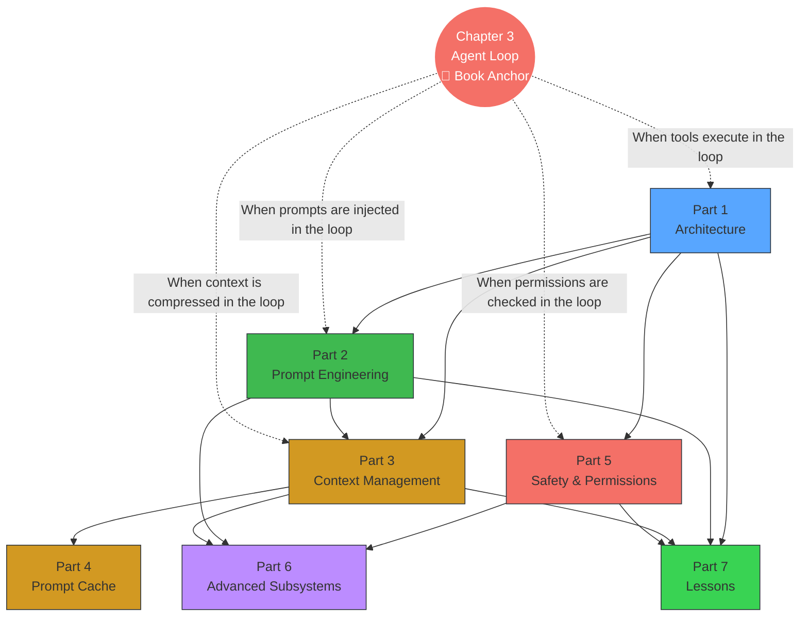

# Preface

  

  <a href="../">Read the Chinese edition</a>

*Harness Engineering* — known informally in Chinese as "The Horse Book" (because the Chinese title sounds like "harness" as in horse harness).

I believe the best way to "consume" the Claude Code source code is to transform it into a book for systematic learning. For me, learning from a book is more comfortable than reading raw source code, and it makes it easier to form a complete cognitive framework.

So I had Claude Code extract a book from the leaked TypeScript source code. The book is now open-sourced, and everyone can read it online:

- Repository: <https://github.com/ZhangHanDong/harness-engineering-from-cc-to-ai-coding>
- Read online: <https://zhanghandong.github.io/harness-engineering-from-cc-to-ai-coding/>

If you want to read the book while gaining a more intuitive understanding of Claude Code's internal mechanisms, pairing it with this visualization site is highly recommended:

- Visualization site: <https://ccunpacked.dev>

To ensure the best possible AI writing quality, the extraction process was not as simple as "throw the source code at the model and let it generate." Instead, it followed a fairly rigorous engineering workflow:

1. First, discuss and clarify `DESIGN.md` based on the source code — that is, establish the outline and design of the entire book.
2. Then write specs for each chapter, using my open-source `agent-spec` to constrain chapter objectives, boundaries, and acceptance criteria.
3. Next, create a plan, breaking down the specific execution steps.
4. Finally, layer on my own technical writing skill before having the AI begin formal writing.

This book is not intended for publication — it's meant to help me learn Claude Code more systematically. My basic judgment is: AI certainly won't write a perfect book, but as long as the initial version is open-sourced, everyone can read, discuss, and gradually improve it together, co-building it into a truly valuable public-domain book.

That said, objectively speaking, this initial version is already quite well-written. Contributions and discussions are welcome. Rather than creating a separate discussion group, all related conversations are hosted on GitHub Discussions:

- Discussions: <https://github.com/ZhangHanDong/harness-engineering-from-cc-to-ai-coding/discussions>

---

## Reading Preparation

### Prerequisites

This book assumes readers have the following basics — you don't need to be an expert, just able to read and understand:

- **TypeScript / JavaScript**: All source code in the book is TypeScript. You need to understand `async/await`, interface definitions, generics, and other basic syntax, but you don't need to write it.
- **CLI development concepts**: Processes, environment variables, stdin/stdout, subprocess communication. If you've used terminal tools (git, npm, cargo), these concepts are already familiar.
- **LLM API basics**: Understanding the messages API (system/user/assistant roles), tool_use (function calling), streaming (streamed responses). If you've called any LLM API, that's enough.

Not required: React / Ink experience, Bun runtime knowledge, Claude Code usage experience.

### Recommended Reading Paths

The book's 30 chapters are organized into 7 parts, but you don't have to read from start to finish. Here are three paths for readers with different goals:

**Path A: Agent Builders** (if you want to build your own AI Agent)

> Chapter 1 (Tech Stack) → Chapter 3 (Agent Loop) → Chapter 5 (System Prompt) → Chapter 9 (Auto Compaction) → Chapter 20 (Agent Spawning) → Chapters 25-27 (Pattern Extraction) → Chapter 30 (Hands-on)

This path covers architecture to loop to prompts to context management to multi-agent, culminating in Chapter 30 where you build a complete code review Agent in Rust.

**Path B: Security Engineers** (if you care about AI Agent security boundaries)

> Chapter 16 (Permission System) → Chapter 17 (YOLO Classifier) → Chapter 18 (Hooks) → Chapter 19 (CLAUDE.md) → Chapter 4 (Tool Orchestration) → Chapter 25 (Fail-Closed Principle)

This path focuses on defense in depth — from permission models to automatic classification to user interception points, understanding how Claude Code balances autonomy and safety.

**Path C: Performance Optimization** (if you care about LLM application costs and latency)

> Chapter 9 (Auto Compaction) → Chapter 11 (Micro Compaction) → Chapter 12 (Token Budget) → Chapter 13 (Cache Architecture) → Chapter 14 (Cache Break Detection) → Chapter 15 (Cache Optimization) → Chapter 21 (Effort/Thinking)

This path covers context management to prompt caching to reasoning control, understanding how Claude Code reduces API costs by 90%.

> **About chapter numbering**: Some chapters have letter suffixes (e.g., ch06b, ch20b, ch20c, ch22b) — these are in-depth extensions of main chapters. For example, ch20b (Teams) and ch20c (Ultraplan) are deep dives into ch20 (Agent Spawning).

### Book Knowledge Map

Chapter 3 (Agent Loop) is the book's anchor — it defines the complete cycle from user input to model response. Other parts each analyze the deep mechanisms of a particular stage within that cycle.

### Reading Notation

This book uses the following conventions:

- **Source references**: Format is `restored-src/src/path/file.ts:line`, pointing to the restored source of Claude Code v2.1.88.
- **Evidence levels**:
  - "v2.1.88 source evidence" — has complete source code and line number references, highest confidence
  - "v2.1.91/v2.1.92 bundle reverse engineering" — inferred from bundle string signals; Anthropic removed source maps starting from v2.1.89
  - "Inference" — speculation from event names or variable names only, no direct source evidence
- **Mermaid diagrams**: Flowcharts and architecture diagrams use Mermaid syntax, rendered automatically when reading online.
- **Interactive visualizations**: Some chapters provide D3.js interactive animation links (marked as "click to view"), which need to be opened in a browser. Each animation also has a static Mermaid diagram as a fallback.
