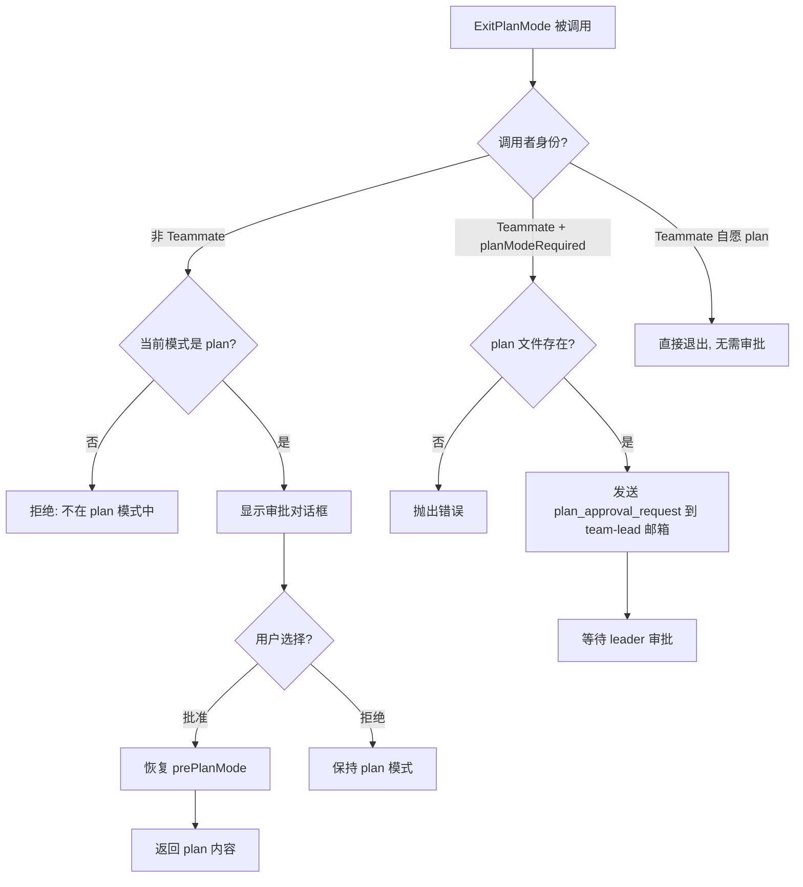
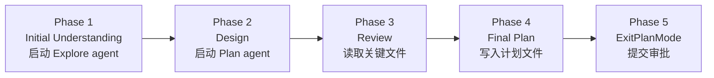

# 第4b章：计划模式 — 从"先做后看"到"先看后做"

> **定位**：本章分析 Claude Code 的计划模式（Plan Mode）——一套完整的"先规划、后执行"状态机。前置依赖：第3章（Agent Loop）、第4章（工具执行编排）。适用场景：想理解 CC 如何实现人机对齐的规划审批机制，或者想在自己的 AI Agent 中实现类似"先计划后行动"流程的读者。

---

## 为什么这很重要

AI 编码 Agent 最大的风险之一不是写错代码，而是**写对了错误的东西**。当用户说"重构认证模块"时，Agent 可能选择 JWT 方案，而用户心中想的是 OAuth2。如果 Agent 直接开始实现，等用户发现方向错误时，已经修改了十几个文件。

Plan Mode 解决的是**意图对齐**问题：在 Agent 动手修改代码之前，先让它探索代码库、制定计划、获得用户审批。这不是简单的"先问再做"——它是一套完整的状态机，涉及权限模式切换、计划文件持久化、工作流提示词注入、团队间审批协议，以及与 Auto Mode 的复杂交互。

从工程角度看，Plan Mode 展示了三个关键设计决策：

1. **权限模式作为行为约束**：进入 plan 模式后，模型的工具集被限制为只读——不是通过提示词"请不要修改文件"，而是通过权限系统在工具调用前拦截写入操作。
2. **计划文件作为对齐载体**：计划不是停留在对话中的文字，而是写入磁盘的 Markdown 文件，用户可以在外部编辑器中修改，CCR 远程会话可以传回本地。
3. **状态机而非布尔开关**：Plan Mode 不是一个简单的 `isPlanMode` 标志，而是包含进入、探索、审批、退出、恢复的完整状态转换链，每个转换都有副作用需要管理。

---

## 4b.1 Plan Mode 状态机：进入与退出

Plan Mode 的核心是两个工具——`EnterPlanMode` 和 `ExitPlanMode`——以及它们触发的权限模式转换。

### 进入 Plan Mode

进入 Plan Mode 有两条路径：

1. **模型主动调用 `EnterPlanMode` 工具**——需要用户确认
2. **用户手动输入 `/plan` 命令**——直接生效

两条路径最终都调用同一个核心函数 `prepareContextForPlanMode`：

```typescript
// restored-src/src/utils/permissions/permissionSetup.ts:1462-1492
export function prepareContextForPlanMode(
  context: ToolPermissionContext,
): ToolPermissionContext {
  const currentMode = context.mode
  if (currentMode === 'plan') return context
  if (feature('TRANSCRIPT_CLASSIFIER')) {
    const planAutoMode = shouldPlanUseAutoMode()
    if (currentMode === 'auto') {
      if (planAutoMode) {
        return { ...context, prePlanMode: 'auto' }
      }
      // ... 关闭 auto mode 并恢复被 auto 剥离的权限
    }
    if (planAutoMode && currentMode !== 'bypassPermissions') {
      autoModeStateModule?.setAutoModeActive(true)
      return {
        ...stripDangerousPermissionsForAutoMode(context),
        prePlanMode: currentMode,
      }
    }
  }
  return { ...context, prePlanMode: currentMode }
}
```

关键设计：**`prePlanMode` 字段保存进入前的模式**。这是一个经典的"保存/恢复"模式——进入 plan 时把当前模式（可能是 `default`、`auto`、`acceptEdits`）存入 `prePlanMode`，退出时恢复。这保证了 Plan Mode 是一个**可逆操作**，不会丢失用户之前的权限配置。

`EnterPlanMode` 工具本身的定义揭示了几个重要约束：

```typescript
// restored-src/src/tools/EnterPlanModeTool/EnterPlanModeTool.ts:36-102
export const EnterPlanModeTool: Tool<InputSchema, Output> = buildTool({
  name: ENTER_PLAN_MODE_TOOL_NAME,
  shouldDefer: true,
  isEnabled() {
    // 当 --channels 活跃时禁用，防止 plan mode 成为陷阱
    if ((feature('KAIROS') || feature('KAIROS_CHANNELS')) &&
        getAllowedChannels().length > 0) {
      return false
    }
    return true
  },
  isConcurrencySafe() { return true },
  isReadOnly() { return true },
  async call(_input, context) {
    if (context.agentId) {
      throw new Error('EnterPlanMode tool cannot be used in agent contexts')
    }
    // ... 执行模式切换
  },
})
```

三个约束值得注意：

| 约束 | 代码 | 原因 |
|------|------|------|
| `shouldDefer: true` | 工具定义 | 延迟加载，不占用初始 schema 空间（详见第2章） |
| 禁止在 Agent 上下文中使用 | `context.agentId` 检查 | 子 agent 不应自行进入 plan 模式，这是主会话的特权 |
| Channels 活跃时禁用 | `getAllowedChannels()` 检查 | KAIROS 模式下用户可能在 Telegram/Discord，无法看到审批对话框——进入 plan 后无法退出，形成"陷阱" |

### 退出 Plan Mode

退出比进入复杂得多。`ExitPlanModeV2Tool` 有三条执行路径：



退出时最复杂的部分是**权限恢复**：

```typescript
// restored-src/src/tools/ExitPlanModeTool/ExitPlanModeV2Tool.ts:357-403
context.setAppState(prev => {
  if (prev.toolPermissionContext.mode !== 'plan') return prev
  setHasExitedPlanMode(true)
  setNeedsPlanModeExitAttachment(true)
  let restoreMode = prev.toolPermissionContext.prePlanMode ?? 'default'
  
  if (feature('TRANSCRIPT_CLASSIFIER')) {
    // 熔断器防御：如果 auto mode 门控已关闭，回退到 default
    if (restoreMode === 'auto' &&
        !(permissionSetupModule?.isAutoModeGateEnabled() ?? false)) {
      restoreMode = 'default'
    }
    // ... auto mode 激活状态同步
  }
  
  // 非 auto 模式：恢复被剥离的危险权限
  const restoringToAuto = restoreMode === 'auto'
  if (restoringToAuto) {
    baseContext = permissionSetupModule?.stripDangerousPermissionsForAutoMode(baseContext)
  } else if (prev.toolPermissionContext.strippedDangerousRules) {
    baseContext = permissionSetupModule?.restoreDangerousPermissions(baseContext)
  }
  
  return {
    ...prev,
    toolPermissionContext: {
      ...baseContext,
      mode: restoreMode,
      prePlanMode: undefined, // 清除保存的模式
    },
  }
})
```

这段代码展示了一个**熔断器防御模式**：如果用户从 auto 模式进入 plan，但在 plan 期间 auto mode 的熔断器触发（比如连续拒绝次数超限），退出 plan 时不会恢复到 auto，而是回退到 `default`。这防止了一个危险场景：Plan Mode 退出后绕过熔断器直接恢复 auto mode。

### 状态转换防抖

用户可能快速切换 plan 模式（进入→立即退出→再进入）。`handlePlanModeTransition` 处理这种边界情况：

```typescript
// restored-src/src/bootstrap/state.ts:1349-1363
export function handlePlanModeTransition(fromMode: string, toMode: string): void {
  // 切换到 plan 时，清除待发的退出附件——防止同时发送进入和退出通知
  if (toMode === 'plan' && fromMode !== 'plan') {
    STATE.needsPlanModeExitAttachment = false
  }
  // 离开 plan 时，标记需要发送退出附件
  if (fromMode === 'plan' && toMode !== 'plan') {
    STATE.needsPlanModeExitAttachment = true
  }
}
```

这是一个典型的**单次通知**设计——附件标志在消费后立即清除，避免重复发送。

---

## 4b.2 Plan 文件：持久化的意图对齐

Plan Mode 的一个关键设计决策是：**计划不停留在对话上下文中，而是写入磁盘文件**。这带来了三个好处：

1. 用户可以在外部编辑器中修改计划（`/plan open`）
2. 计划在上下文压缩后不会丢失（详见第10章）
3. CCR 远程会话的计划可以传回本地终端

### 文件命名与存储

```typescript
// restored-src/src/utils/plans.ts:79-128
export const getPlansDirectory = memoize(function getPlansDirectory(): string {
  const settings = getInitialSettings()
  const settingsDir = settings.plansDirectory
  let plansPath: string

  if (settingsDir) {
    const cwd = getCwd()
    const resolved = resolve(cwd, settingsDir)
    // 路径穿越防御
    if (!resolved.startsWith(cwd + sep) && resolved !== cwd) {
      logError(new Error(`plansDirectory must be within project root: ${settingsDir}`))
      plansPath = join(getClaudeConfigHomeDir(), 'plans')
    } else {
      plansPath = resolved
    }
  } else {
    plansPath = join(getClaudeConfigHomeDir(), 'plans')
  }
  // ...
})

export function getPlanFilePath(agentId?: AgentId): string {
  const planSlug = getPlanSlug(getSessionId())
  if (!agentId) {
    return join(getPlansDirectory(), `${planSlug}.md`)  // 主会话
  }
  return join(getPlansDirectory(), `${planSlug}-agent-${agentId}.md`)  // 子 agent
}
```

| 维度 | 设计决策 | 原因 |
|------|---------|------|
| 默认位置 | `~/.claude/plans/` | 与项目无关的全局目录，不污染代码仓库 |
| 可配置 | `settings.plansDirectory` | 团队可以配置为项目内目录，如 `.claude/plans/` |
| 路径穿越防御 | `resolved.startsWith(cwd + sep)` | 防止配置的路径逃逸到项目根目录之外 |
| 文件名 | `{wordSlug}.md` | 使用词组 slug（如 `brave-fox.md`）而非 UUID，人类可读 |
| 子 agent 隔离 | `{wordSlug}-agent-{agentId}.md` | 每个子 agent 有独立的计划文件，避免覆盖 |
| 记忆化 | `memoize(getPlansDirectory)` | 避免每次工具渲染触发 `mkdirSync` 系统调用（#20005 回归修复） |

### Plan Slug 生成

每个会话生成唯一的词组 slug，缓存在 `planSlugCache` 中：

```typescript
// restored-src/src/utils/plans.ts:32-49
export function getPlanSlug(sessionId?: SessionId): string {
  const id = sessionId ?? getSessionId()
  const cache = getPlanSlugCache()
  let slug = cache.get(id)
  if (!slug) {
    const plansDir = getPlansDirectory()
    for (let i = 0; i < MAX_SLUG_RETRIES; i++) {
      slug = generateWordSlug()
      const filePath = join(plansDir, `${slug}.md`)
      if (!getFsImplementation().existsSync(filePath)) {
        break  // 找到不冲突的 slug
      }
    }
    cache.set(id, slug!)
  }
  return slug!
}
```

冲突检测最多重试 10 次（`MAX_SLUG_RETRIES = 10`）。由于 `generateWordSlug()` 使用 `adjective-noun` 组合（词汇表规模通常在数千个形容词 × 数千个名词，组合空间达百万级），即使在频繁使用的目录中，冲突概率也极低。

### `/plan` 命令

用户通过 `/plan` 命令与计划交互：

```typescript
// restored-src/src/commands/plan/plan.tsx:64-121
export async function call(onDone, context, args) {
  const currentMode = appState.toolPermissionContext.mode
  
  // 如果不在 plan 模式，启用它
  if (currentMode !== 'plan') {
    handlePlanModeTransition(currentMode, 'plan')
    setAppState(prev => ({
      ...prev,
      toolPermissionContext: applyPermissionUpdate(
        prepareContextForPlanMode(prev.toolPermissionContext),
        { type: 'setMode', mode: 'plan', destination: 'session' },
      ),
    }))
    const description = args.trim()
    if (description && description !== 'open') {
      onDone('Enabled plan mode', { shouldQuery: true })  // 带描述 → 触发查询
    } else {
      onDone('Enabled plan mode')
    }
    return null
  }
  
  // 已在 plan 模式 — 显示当前计划或在编辑器中打开
  if (argList[0] === 'open') {
    const result = await editFileInEditor(planPath)
    // ...
  }
}
```

`/plan` 命令有四种行为：
- `/plan` — 启用 plan 模式（如果当前不在 plan 模式）
- `/plan <描述>` — 启用 plan 模式并带入描述（`shouldQuery: true` 触发模型开始规划）
- `/plan`（已在 plan 模式中）— 显示当前计划内容和文件路径；如无计划则提示 "No plan written yet"
- `/plan open` — 在外部编辑器中打开计划文件

---

## 4b.3 Plan 提示词注入：5 阶段工作流

进入 Plan Mode 后，系统通过**附件消息**（Attachment）向模型注入工作流指令。这是 Plan Mode 行为约束的核心——不是靠工具限制告诉模型"不能做什么"，而是通过提示词告诉模型"应该做什么"。

### 附件类型

Plan Mode 使用三种附件类型：

| 附件类型 | 触发时机 | 内容 |
|---------|---------|------|
| `plan_mode` | 每 N 轮人类消息注入一次 | 完整或精简的工作流指令 |
| `plan_mode_reentry` | 退出后再次进入 plan 模式 | "你之前退出过计划模式，请先检查现有计划" |
| `plan_mode_exit` | 退出 plan 模式后的第一轮 | "你已退出计划模式，现在可以开始实现" |

### Full vs. Sparse 节流

```typescript
// restored-src/src/utils/attachments.ts:1195-1241
function getPlanModeAttachments(messages, toolUseContext) {
  // 检查距离上次 plan_mode 附件的人类轮次数
  const { turnCount, foundPlanModeAttachment } = 
    getPlanModeAttachmentTurnCount(messages)
  
  // 已有附件且间隔不足 → 跳过
  if (foundPlanModeAttachment &&
      turnCount < PLAN_MODE_ATTACHMENT_CONFIG.TURNS_BETWEEN_ATTACHMENTS) {
    return []
  }
  
  // 决定 full 还是 sparse
  const attachmentCount = countPlanModeAttachmentsSinceLastExit(messages)
  const reminderType = attachmentCount %
    PLAN_MODE_ATTACHMENT_CONFIG.FULL_REMINDER_EVERY_N_ATTACHMENTS === 1
    ? 'full' : 'sparse'
  
  attachments.push({ type: 'plan_mode', reminderType, isSubAgent, planFilePath, planExists })
  return attachments
}
```

**Full 附件**包含完整的 5 阶段工作流指令（约 2,000+ 字符），**sparse 附件**只有一行提醒：

```
Plan mode still active (see full instructions earlier in conversation). 
Read-only except plan file ({planFilePath}). Follow 5-phase workflow.
```

这是一个**token 成本优化**——full 指令只在第 1 次、第 6 次、第 11 次…注入，其余轮次用 sparse。计数器在每次退出 plan 模式时重置。

### 5 阶段工作流（标准模式）

当 `isPlanModeInterviewPhaseEnabled()` 返回 `false` 时，模型收到 5 阶段指令：



```typescript
// restored-src/src/utils/messages.ts:3227-3292 (核心指令，简化展示)
const content = `Plan mode is active. The user indicated that they do not want 
you to execute yet -- you MUST NOT make any edits (with the exception of the 
plan file mentioned below)...

## Plan Workflow

### Phase 1: Initial Understanding
Goal: Gain a comprehensive understanding of the user's request...
Launch up to ${exploreAgentCount} Explore agents IN PARALLEL...

### Phase 2: Design
Launch Plan agent(s) to design the implementation...
You can launch up to ${agentCount} agent(s) in parallel.

### Phase 3: Review
Read the critical files identified by agents...
Use AskUserQuestion to clarify any remaining questions.

### Phase 4: Final Plan
Write your final plan to the plan file (the only file you can edit).

### Phase 5: Call ExitPlanMode
Once you are happy with your final plan file - call ExitPlanMode.
This is critical - your turn should only end with either AskUserQuestion OR ExitPlanMode.`
```

Agent 数量根据订阅级别动态调整：

```typescript
// restored-src/src/utils/planModeV2.ts:5-29
export function getPlanModeV2AgentCount(): number {
  // 环境变量覆盖
  if (process.env.CLAUDE_CODE_PLAN_V2_AGENT_COUNT) { /* ... */ }
  // Max 20x 订阅 → 3 个 agent
  if (subscriptionType === 'max' && rateLimitTier === 'default_claude_max_20x') return 3
  // Enterprise/Team → 3 个 agent
  if (subscriptionType === 'enterprise' || subscriptionType === 'team') return 3
  // 其他 → 1 个 agent
  return 1
}
```

| 订阅级别 | Plan Agent 数量 | Explore Agent 数量 |
|---------|----------------|-------------------|
| Max (20x) | 3 | 3 |
| Enterprise / Team | 3 | 3 |
| 其他 | 1 | 3 |

### Interview 工作流（迭代模式）

当 `isPlanModeInterviewPhaseEnabled()` 返回 `true`（Anthropic 内部用户始终为 true）时，使用另一种工作流：

```typescript
// restored-src/src/utils/messages.ts:3323-3378
const content = `Plan mode is active...

## Iterative Planning Workflow

You are pair-planning with the user. Explore the code to build context, 
ask the user questions when you hit decisions you can't make alone, and 
write your findings into the plan file as you go.

### The Loop
Repeat this cycle until the plan is complete:
1. **Explore** — Use Read, Glob, Grep to read code...
2. **Update the plan file** — After each discovery, immediately capture what you learned.
3. **Ask the user** — When you hit an ambiguity, use AskUserQuestion. Then go back to step 1.

### First Turn
Start by quickly scanning a few key files... Then write a skeleton plan and 
ask the user your first round of questions. Don't explore exhaustively before engaging the user.

### Asking Good Questions
- Never ask what you could find out by reading the code
- Batch related questions together
- Focus on things only the user can answer: requirements, preferences, tradeoffs`
```

Interview 模式与标准 5 阶段模式的核心区别：

| 维度 | 5 阶段模式 | Interview 模式 |
|------|-----------|---------------|
| 交互风格 | 先探索完再提交计划 | 边探索边提问，迭代完善 |
| Agent 使用 | 强制使用 Explore/Plan agent | 鼓励直接使用工具，可选用 agent |
| 计划文件 | Phase 4 一次写入 | 增量更新，每次发现都写入 |
| 用户参与时机 | Phase 5 最终审批 | 全程参与，多轮对话 |
| 目标用户 | 外部用户（更自动化） | 内部用户（更协作） |

### Pewter Ledger 实验：计划文件长度优化

Plan Mode 的一个有趣 A/B 实验是 `tengu_pewter_ledger`——优化计划文件的结构和长度：

```typescript
// restored-src/src/utils/planModeV2.ts:66-95
// Baseline (control, 14d ending 2026-03-02, N=26.3M):
//   p50 4,906 chars | p90 11,617 | mean 6,207 | 82% Opus 4.6
//   Reject rate monotonic with size: 20% at <2K → 50% at 20K+
//
// Primary: session-level Avg Cost
export function getPewterLedgerVariant(): PewterLedgerVariant {
  const raw = getFeatureValue_CACHED_MAY_BE_STALE('tengu_pewter_ledger', null)
  if (raw === 'trim' || raw === 'cut' || raw === 'cap') return raw
  return null
}
```

四个实验臂对 Phase 4 指令进行渐进式收紧：

| 实验臂 | 关键指令 | 目标效果 |
|--------|---------|---------|
| **control** | "Begin with Context section... concise enough to scan quickly" | 基线：mean 6,207 chars |
| **trim** | "One-line Context... single verification command" | 轻度压缩 |
| **cut** | "Do NOT write Context/Background... Most good plans under 40 lines" | 中度压缩 |
| **cap** | "Hard limit: 40 lines. If longer, delete prose — not file paths" | 强制上限 |

注释中记录的基线数据揭示了一个关键发现：**拒绝率与计划长度单调正相关**——2K 字符以下的计划拒绝率 20%，20K+ 的计划拒绝率 50%。这意味着更长的计划并不意味着更好的计划。

### 内外有别的触发阈值

EnterPlanMode 的工具提示词有两个版本：

```typescript
// restored-src/src/tools/EnterPlanModeTool/prompt.ts:166-170
export function getEnterPlanModeToolPrompt(): string {
  return process.env.USER_TYPE === 'ant'
    ? getEnterPlanModeToolPromptAnt()
    : getEnterPlanModeToolPromptExternal()
}
```

| 维度 | 外部用户版 | 内部用户版 |
|------|----------|----------|
| 触发阈值 | **低**——"Prefer using EnterPlanMode for implementation tasks unless simple" | **高**——"Plan mode is valuable when approach is genuinely unclear" |
| 举例差异 | "Add a delete button" → **应该** plan（涉及确认对话框、API、状态） | "Add a delete button" → **不应该** plan（"Implementation path is clear"） |
| 默认偏好 | "If unsure, err on the side of planning" | "Prefer starting work and using AskUserQuestion" |

这种内外差异反映了一个产品策略：外部用户更需要对齐保护（避免 Agent 跑偏后大量返工），而内部用户更熟悉工具行为，更倾向快速执行。

---

## 4b.4 审批流程：人机协作的关键节点

### 用户审批（标准流程）

当模型调用 `ExitPlanMode` 时，非 Teammate 场景下触发用户审批对话框：

```typescript
// restored-src/src/tools/ExitPlanModeTool/ExitPlanModeV2Tool.ts:221-238
async checkPermissions(input, context) {
  if (isTeammate()) {
    return { behavior: 'allow' as const, updatedInput: input }
  }
  return {
    behavior: 'ask' as const,
    message: 'Exit plan mode?',
    updatedInput: input,
  }
}
```

审批后，`mapToolResultToToolResultBlockParam` 将批准的计划注入 tool_result：

```typescript
// restored-src/src/tools/ExitPlanModeTool/ExitPlanModeV2Tool.ts:481-492
return {
  type: 'tool_result',
  content: `User has approved your plan. You can now start coding. Start with updating your todo list if applicable

Your plan has been saved to: ${filePath}
You can refer back to it if needed during implementation.${teamHint}

## ${planLabel}:
${plan}`,
  tool_use_id: toolUseID,
}
```

如果用户在 CCR Web UI 中编辑了计划，`planWasEdited` 标志确保模型知道内容已被修改：

```typescript
// restored-src/src/tools/ExitPlanModeTool/ExitPlanModeV2Tool.ts:477-478
const planLabel = planWasEdited
  ? 'Approved Plan (edited by user)'
  : 'Approved Plan'
```

### Team Leader 审批

在 Teams 模式下，Teammate agent 的计划需要 team lead 审批（详见第20b章）。`ExitPlanModeV2Tool` 通过邮箱系统发送审批请求：

```typescript
// restored-src/src/tools/ExitPlanModeTool/ExitPlanModeV2Tool.ts:264-312
if (isTeammate() && isPlanModeRequired()) {
  const approvalRequest = {
    type: 'plan_approval_request',
    from: agentName,
    timestamp: new Date().toISOString(),
    planFilePath: filePath,
    planContent: plan,
    requestId,
  }
  
  await writeToMailbox('team-lead', {
    from: agentName,
    text: jsonStringify(approvalRequest),
    timestamp: new Date().toISOString(),
  }, teamName)
  
  return {
    data: {
      plan, isAgent: true, filePath,
      awaitingLeaderApproval: true,
      requestId,
    },
  }
}
```

审批请求是一个 JSON 消息，写入 team lead 的邮箱文件（`~/.claude/teams/{team}/inboxes/team-lead.json`）。消息使用 `proper-lockfile` 确保并发安全。

### 验证 Plan 执行

ExitPlanMode 的返回值中包含 `hasTaskTool` 标志：

```typescript
// restored-src/src/tools/ExitPlanModeTool/ExitPlanModeV2Tool.ts:405-408
const hasTaskTool =
  isAgentSwarmsEnabled() &&
  context.options.tools.some(t => toolMatchesName(t, AGENT_TOOL_NAME))
```

当 Agent Swarms 可用时，tool_result 中会追加提示：

> If this plan can be broken down into multiple independent tasks, consider using the TeamCreate tool to create a team and parallelize the work.

这将 Plan Mode 的输出**无缝对接**到多 Agent 执行（详见第20b章）。

---

## 4b.5 Auto Mode 与 Plan Mode 的交互

Auto Mode（YOLO 分类器，详见第17章）与 Plan Mode 的交互是 CC 权限系统中最复杂的部分之一。

### 进入时的权限保存

当用户从 auto 模式进入 plan 模式时，有两种策略：

```typescript
// restored-src/src/utils/permissions/permissionSetup.ts:1469-1486
if (currentMode === 'auto') {
  if (planAutoMode) {
    // 保持 auto 激活 → plan 期间分类器继续工作
    return { ...context, prePlanMode: 'auto' }
  }
  // 关闭 auto → 剥离危险权限
  // ...
}
```

`shouldPlanUseAutoMode()` 根据用户设置决定：plan 期间是否保持分类器活跃。如果保持活跃，模型在 plan 模式下的只读操作仍由分类器自动批准；如果关闭，所有操作都需要用户确认。

### 退出时的熔断器检查

```typescript
// restored-src/src/tools/ExitPlanModeTool/ExitPlanModeV2Tool.ts:328-346
if (feature('TRANSCRIPT_CLASSIFIER')) {
  const prePlanRaw = appState.toolPermissionContext.prePlanMode ?? 'default'
  if (prePlanRaw === 'auto' &&
      !(permissionSetupModule?.isAutoModeGateEnabled() ?? false)) {
    const reason = permissionSetupModule?.getAutoModeUnavailableReason() ?? 'circuit-breaker'
    gateFallbackNotification = 
      permissionSetupModule?.getAutoModeUnavailableNotification(reason) ??
      'auto mode unavailable'
  }
}
```

这段逻辑确保：**如果 plan 期间 auto mode 的熔断器触发了（比如分类器连续拒绝超限），退出 plan 时不会恢复到 auto，而是降级为 default**。用户会看到一条通知：

> plan exit → default · auto mode unavailable

### 中途设置变更

如果用户在 plan 模式期间修改了 `useAutoModeDuringPlan` 设置，`transitionPlanAutoMode` 立即生效：

```typescript
// restored-src/src/utils/permissions/permissionSetup.ts:1502-1517
export function transitionPlanAutoMode(
  context: ToolPermissionContext,
): ToolPermissionContext {
  if (context.mode !== 'plan') return context
  // bypassPermissions 进入的 plan 不允许激活 auto
  if (context.prePlanMode === 'bypassPermissions') return context
  
  const want = shouldPlanUseAutoMode()
  const have = autoModeStateModule?.isAutoModeActive() ?? false
  // 根据 want/have 激活或关闭 auto
}
```

---

## 4b.6 Plan Agent：只读的架构师

Plan Mode 的 5 阶段工作流在 Phase 2 使用内置的 Plan agent（详见第20章的 agent 系统）。这个 agent 的定义展示了如何通过工具限制强制只读：

```typescript
// restored-src/src/tools/AgentTool/built-in/planAgent.ts:73-92
export const PLAN_AGENT: BuiltInAgentDefinition = {
  agentType: 'Plan',
  disallowedTools: [
    AGENT_TOOL_NAME,      // 不能派生子 agent
    EXIT_PLAN_MODE_TOOL_NAME,  // 不能退出 plan 模式
    FILE_EDIT_TOOL_NAME,  // 不能编辑文件
    FILE_WRITE_TOOL_NAME, // 不能写入文件
    NOTEBOOK_EDIT_TOOL_NAME,
  ],
  tools: EXPLORE_AGENT.tools,
  omitClaudeMd: true,     // 不注入 CLAUDE.md，节省 token
  getSystemPrompt: () => getPlanV2SystemPrompt(),
}
```

Plan agent 的系统提示词进一步强化只读约束：

```
=== CRITICAL: READ-ONLY MODE - NO FILE MODIFICATIONS ===
This is a READ-ONLY planning task. You are STRICTLY PROHIBITED from:
- Creating new files (no Write, touch, or file creation of any kind)
- Modifying existing files (no Edit operations)
- Using redirect operators (>, >>, |) or heredocs to write to files
- Running ANY commands that change system state
```

双重约束（工具黑名单 + 提示词禁令）确保即使模型"忘记"了工具限制，提示词也会阻止它尝试写操作。

---

## 模式提炼

从 Plan Mode 的实现中，可以提炼出以下可复用的 AI Agent 设计模式：

### 模式 1：保存/恢复权限模式

**问题**：临时进入受限模式后，需要精确恢复到之前的状态。

**方案**：在权限上下文中增加 `prePlanMode` 字段，进入时保存、退出时恢复。

```
进入: context.prePlanMode = context.mode; context.mode = 'plan'
退出: context.mode = context.prePlanMode; context.prePlanMode = undefined
```

**前置条件**：退出时必须检查熔断器等外部条件是否仍然允许恢复到原模式。如果不允许，降级到安全默认值。

### 模式 2：计划文件作为对齐载体

**问题**：对话上下文中的计划会被压缩丢失，用户无法在 Agent 之外查看或编辑。

**方案**：将计划写入磁盘文件，使用人类可读的命名（word slug），支持外部编辑和跨会话恢复。

**前置条件**：需要路径穿越防御、冲突检测、远程会话的快照持久化。

### 模式 3：Full/Sparse 节流

**问题**：每轮都注入完整工作流指令浪费 token，但完全不提醒模型会偏离流程。

**方案**：首次注入 full 指令，后续使用 sparse 提醒，每 N 次重新注入 full。计数器在状态转换时重置。

**前置条件**：需要按人类轮次（而非工具调用轮次）计数，否则 10 次工具调用就触发重复提醒。

### 模式 4：内外差异的行为校准

**问题**：不同用户群体对 Agent 自主性的期望不同。外部用户更需要对齐保护，内部用户更需要执行效率。

**方案**：通过 `USER_TYPE` 区分提示词变体。外部版本降低触发阈值（"if unsure, plan"），内部版本提高阈值（"start working, ask specific questions"）。

**前置条件**：需要 A/B 测试基础设施验证不同阈值对用户满意度和返工率的影响。

### 模式 5：状态转换防抖

**问题**：用户快速切换模式（plan → normal → plan）可能导致重复或矛盾的通知。

**方案**：使用单次消费的标志（`needsPlanModeExitAttachment`），进入时清除待发的退出通知，退出时设置新的通知。

**前置条件**：标志必须在消费（附件发送）后立即清除，且进入/退出操作必须互斥地操作标志。

---

## 用户能做什么

### 基本使用

| 操作 | 方式 |
|------|------|
| 进入 Plan Mode | `/plan` 或 `/plan <描述>`，或让模型自行调用 `EnterPlanMode` |
| 查看当前计划 | 再次输入 `/plan` |
| 在编辑器中修改计划 | `/plan open` |
| 退出 Plan Mode | 模型调用 `ExitPlanMode` → 用户在审批对话框中确认 |

### 配置选项

| 设置 | 效果 |
|------|------|
| `settings.plansDirectory` | 自定义计划文件存储目录（相对于项目根目录） |
| `CLAUDE_CODE_PLAN_V2_AGENT_COUNT` | 覆盖 Plan agent 数量（1-10） |
| `CLAUDE_CODE_PLAN_V2_EXPLORE_AGENT_COUNT` | 覆盖 Explore agent 数量（1-10） |
| `CLAUDE_CODE_PLAN_MODE_INTERVIEW_PHASE` | 启用 interview 工作流（`true`/`false`） |

### 使用建议

1. **大型重构优先 Plan Mode**：涉及 3+ 文件的修改，先 `/plan 重构认证系统` 让模型制定方案，确认后再执行。
2. **修改计划而非重新规划**：如果计划大体正确但需要调整，使用 `/plan open` 直接在编辑器中修改，比让模型重新规划更高效。
3. **Agent 启动时指定 `mode: 'plan'`**：通过 Agent 工具的 `mode` 参数，可以让子 agent 在 plan 模式下工作，确保大型任务在执行前经过审批。

---

## 版本演化说明

> 本章核心分析基于 Claude Code v2.1.88。Plan Mode 是一个活跃演化的子系统——interview 工作流（`tengu_plan_mode_interview_phase`）和计划长度实验（`tengu_pewter_ledger`）在分析时仍在进行 A/B 测试。Ultraplan（远程计划模式）作为 Plan Mode 的远程扩展，详见第20c章。
