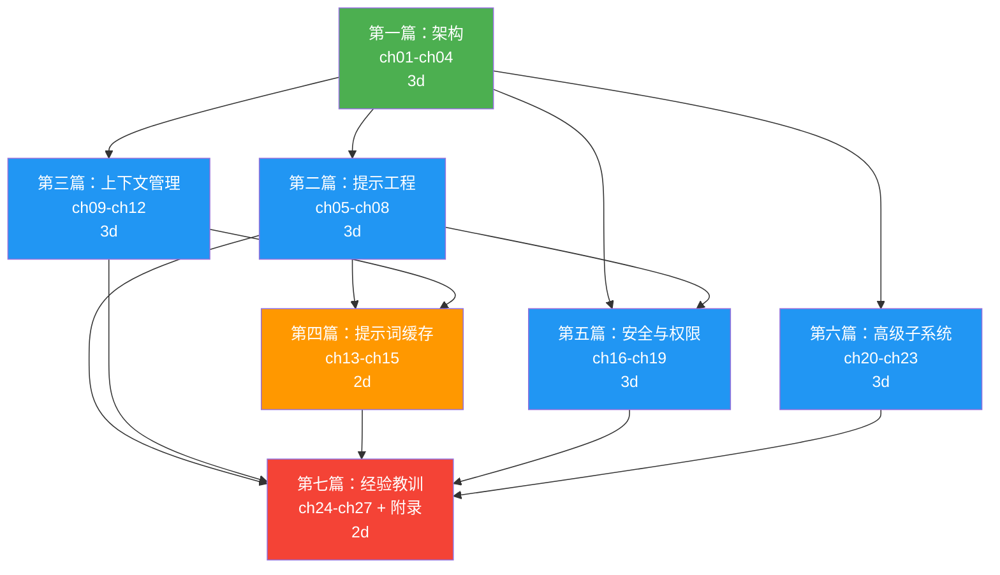

# 写作执行计划（v2）

## 变更记录

- v1: 25 章 + 3 附录
- v2: 27 章 + 4 附录。新增第3章（Agent Loop）、第4章（工具执行编排）、第22章（技能系统扩充）、第23章（Feature Flag 路线图）、附录 D

## 依赖图



## 关键路径

```
P1 (3d) → P2 (3d) → P4 (2d) → P7 (2d) = 10d
P1 (3d) → P3 (3d) → P4 (2d) → P7 (2d) = 10d（并行路径）
```

## 执行批次

### 批次 1：基础（必须先完成）
| 任务 | 章节 | Spec | 预估 |
|------|------|------|------|
| 第一篇 | ch01-ch04 | `part1-architecture.spec.md` | 3d |

### 批次 2：四篇并行
| 任务 | 章节 | Spec | 预估 | 依赖 |
|------|------|------|------|------|
| 第二篇 | ch05-ch08 | `part2-prompt-engineering.spec.md` | 3d | P1 |
| 第三篇 | ch09-ch12 | `part3-context-management.spec.md` | 3d | P1 |
| 第五篇 | ch16-ch19 | `part5-safety-permissions.spec.md` | 3d | P1 |
| 第六篇 | ch20-ch23 | `part6-advanced-subsystems.spec.md` | 3d | P1 |

### 批次 3：依赖前两批
| 任务 | 章节 | Spec | 预估 | 依赖 |
|------|------|------|------|------|
| 第四篇 | ch13-ch15 | `part4-prompt-cache.spec.md` | 2d | P2, P3 |

### 批次 4：全书收尾
| 任务 | 章节 | Spec | 预估 | 依赖 |
|------|------|------|------|------|
| 第七篇 | ch24-ch27 + 附录 | `part7-lessons.spec.md` | 2d | 全部 |

## 每批执行策略

每批内部使用并行 agent 写作：
- 每章启动一个独立 agent
- agent prompt 包含：该章的 spec 验收标准 + 需要读取的源码文件清单 + 输出文件路径
- 写作完成后人工 review，对照 spec 验收标准逐条检查

## 章节 ↔ 文件映射（31 个文件）

```
docs/chapters/
├── ch01-tech-stack.md            # 第一篇
├── ch02-tool-system.md
├── ch03-agent-loop.md            # ← 新增
├── ch04-tool-orchestration.md    # ← 新增
├── ch05-system-prompt-arch.md    # 第二篇（原 ch04）
├── ch06-behavioral-steering.md   # （原 ch05）
├── ch07-model-tuning-ab.md       # （原 ch06）
├── ch08-tool-prompts.md          # （原 ch07）
├── ch09-auto-compaction.md       # 第三篇（原 ch08）
├── ch10-file-state-preservation.md
├── ch11-microcompact.md
├── ch12-token-budgeting.md
├── ch13-cache-architecture.md    # 第四篇（原 ch12）
├── ch14-cache-break-detection.md
├── ch15-cache-optimization-patterns.md
├── ch16-permission-system.md     # 第五篇（原 ch15）
├── ch17-yolo-classifier.md
├── ch18-hooks.md
├── ch19-claudemd.md
├── ch20-agent-swarm.md           # 第六篇（原 ch19）
├── ch21-effort-fast-thinking.md
├── ch22-skill-system.md          # ← 扩充
├── ch23-feature-flags-roadmap.md # ← 新增
├── ch24-harness-principles.md    # 第七篇（原 ch22）
├── ch25-context-principles.md
├── ch26-production-patterns.md
├── ch27-limitations.md
├── appendix-a-file-index.md
├── appendix-b-env-vars.md
├── appendix-c-glossary.md
└── appendix-d-feature-flags.md   # ← 新增
```
